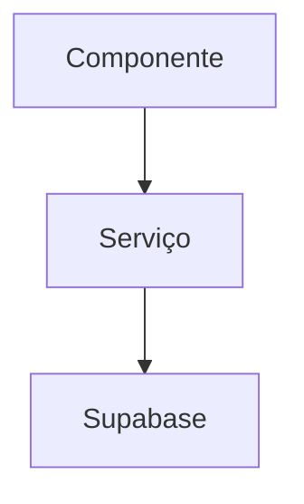

# AGENTS.md — Guia Obrigatório para IAs

> Este arquivo é lido automaticamente pelo **Antigravity** e outros agentes de IA.
> Ele define o protocolo obrigatório de trabalho neste repositório.

---

## 1. Leitura Obrigatória ao Iniciar

Antes de qualquer alteração de código, leia **todos** estes arquivos:

| Prioridade | Arquivo | O que contém |
|---|---|---|
| 🔴 Alta | [`AI_KNOWLEDGE_BASE.md`](./AI_KNOWLEDGE_BASE.md) | Log de features, arquitetura, regras de negócio e decisões passadas |
| 🔴 Alta | [`.github/copilot-instructions.md`](./.github/copilot-instructions.md) | Padrões de código, TypeScript, testes, commits e segurança |
| 🟡 Média | [`docs/ai/01_ARCHITECTURE_AND_DATA.md`](./docs/ai/01_ARCHITECTURE_AND_DATA.md) | Arquitetura, Supabase e fluxo RPC |
| 🟡 Média | [`docs/ai/02_UX_AND_BUSINESS_RULES.md`](./docs/ai/02_UX_AND_BUSINESS_RULES.md) | Regras de UX, Parser, Bulk Mode |
| 🟡 Média | [`docs/ai/04_RPC_CONTRACTS.md`](./docs/ai/04_RPC_CONTRACTS.md) | Contratos das funções Postgres/RPC |
| 🟢 Contextual | [`docs/ai/03_COMPONENTS.md`](./docs/ai/03_COMPONENTS.md) | Componentes UI (Tailwind/daisyUI) |
| 🟢 Contextual | [`docs/ai/06_E2E_TESTING.md`](./docs/ai/06_E2E_TESTING.md) | Arquitetura de testes E2E |

---

## 2. Stack do Projeto

| Camada | Tecnologia |
|---|---|
| Frontend | React 19 + TypeScript 5 + Vite |
| Estilo | Tailwind CSS v4 + daisyUI v5 |
| Estado | Zustand v5 |
| Backend | Supabase (Postgres + Auth + RLS + Edge Functions) |
| Roteamento | React Router v7 |
| Testes unitários | Vitest + Testing Library |
| Testes E2E | Playwright |
| Deploy | Vercel (Edge Functions em `api/`) |
| CI/CD | GitHub Actions + Semantic Release |

---

## 3. Protocolo Obrigatório por Fase

### 3.1 Antes de começar
- [ ] Leu `AI_KNOWLEDGE_BASE.md` completamente
- [ ] Leu `.github/copilot-instructions.md`
- [ ] Criou um **plano de tarefas** e apresentou ao usuário
- [ ] Aguardou aprovação explícita antes de tocar em qualquer arquivo

### 3.2 Durante o desenvolvimento
- [ ] Sem `any` em TypeScript — use `unknown` se necessário
- [ ] Apenas **arrow functions** (`const fn = () => {}`) — nunca `function`
- [ ] Componentes daisyUI têm prioridade sobre componentes customizados
- [ ] `data-testid` em todos os elementos interativos
- [ ] JSDoc apenas em funções públicas, sem comentários óbvios
- [ ] Sem emojis em código-fonte ou comentários (apenas em documentação)

### 3.3 Antes de finalizar
Execute nesta ordem:

```bash
npm run lint        # ESLint — zero erros tolerados
npm run typecheck   # tsc -b — zero erros TypeScript
npm test            # Vitest — todos os testes devem passar
npm run build       # Build de produção — sem erros
```

> Para mudanças que afetam fluxos E2E críticos: `npm run e2e`

### 3.4 Após finalizar
- [ ] Atualizou `AI_KNOWLEDGE_BASE.md` com o log da feature (formato obrigatório abaixo)
- [ ] Propôs a mensagem de commit ao usuário
- [ ] Aguardou aprovação explícita antes de commitar

---

## 4. Regras Críticas de Segurança

```typescript
// ❌ NUNCA — vulnerabilidade XSS
element.innerHTML = userInput;
const API_KEY = "sk_123...";

// ✅ SEMPRE
element.textContent = userInput;
const API_KEY = import.meta.env.VITE_API_KEY;
```

- Reportar imediatamente: XSS, secrets no código, SQL injection, inputs sem validação
- Jamais expor stack traces para o usuário final
- Variáveis de ambiente sensíveis ficam **apenas** no `.env` (nunca commitadas)

---

## 5. Padrão de Commits

Formato: `tipo: emoji descrição no imperativo`

| Tipo | Emoji | Uso |
|---|---|---|
| `feat` | ✨ | Novo recurso |
| `fix` | 🐛 | Correção de bug |
| `docs` | 📚 | Documentação |
| `refactor` | ♻️ | Refatoração |
| `test` | 🧪 | Testes |
| `chore` | 🔧 | Deps, configs |
| `perf` | ⚡ | Performance |
| `ci` | 🧱 | CI/CD |
| `cleanup` | 🧹 | Remoção de código morto |

> **⚠️ REGRA ABSOLUTA:** Nunca commitar sem aprovação explícita do usuário.
> Sempre propor a mensagem e perguntar: *"Posso commitar com essa mensagem?"*

---

## 6. Workflow de Branches

```
main       ← produção (apenas via PR)
develop    ← integração
feature/*  ← novas funcionalidades
fix/*      ← correções
docs/*     ← documentação
```

Ordem antes de commitar:
1. `git branch` — confirmar branch
2. `git pull origin <branch>` — sincronizar
3. `git add <arquivos>`
4. `git commit -m "tipo: emoji descrição"`
5. `git push origin <branch>`
6. Abrir Pull Request (nunca merge manual na `main`)

---

## 7. Supabase — Regras Especiais

- **RLS obrigatório** em todas as tabelas expostas ao frontend
- Migrations são versionadas em `supabase/migrations/` com timestamp no nome
- Nunca usar `service_role` key no cliente do frontend (apenas em `e2e/config/`)
- RPCs devem ter contratos documentados em `docs/ai/04_RPC_CONTRACTS.md`
- Ao criar nova migration, testar localmente com `supabase db reset` antes

---

## 8. Formato Obrigatório de Log no `AI_KNOWLEDGE_BASE.md`

Toda feature ou correção significativa deve ser logada com este formato:

```markdown
### 📝 (DD/MM/AAAA) Título da Feature

#### Arquitetura


#### Arquivos Modificados / Criados
| Arquivo | Mudança / Propósito |
|---|---|
| `src/...` | Descrição |

#### Lógica de Decisão
```text
REGRA: Se X então Y
```

#### Comportamento
- Bullet points do que o sistema faz na prática

#### Checklist de Aceite
- [x] Lint passando
- [x] Testes passando
- [x] Build sem erros
```

---

## 9. Onde Agentes Encontram Informações

| Necessidade | Onde buscar |
|---|---|
| Regras de negócio e features | `AI_KNOWLEDGE_BASE.md` |
| Padrões de código e estilo | `.github/copilot-instructions.md` |
| Arquitetura e Supabase | `docs/ai/01_ARCHITECTURE_AND_DATA.md` |
| UX e Parser | `docs/ai/02_UX_AND_BUSINESS_RULES.md` |
| Componentes UI | `docs/ai/03_COMPONENTS.md` |
| RPCs e contratos Postgres | `docs/ai/04_RPC_CONTRACTS.md` |
| Schema do banco | `docs/ai/05_DATABASE_MAP.md` |
| Testes E2E | `docs/ai/06_E2E_TESTING.md` |
| Glossário de domínio | `docs/GLOSSARY.md` |
| ADRs (decisões de arquitetura) | `docs/adr/` |

---

## 10. Skills Disponíveis (Antigravity)

Este projeto possui skills customizadas em `.agents/skills/`:

- **`supabase`** — Use para qualquer tarefa com Supabase (Auth, DB, RLS, Edge Functions, Migrations)
- **`supabase-postgres-best-practices`** — Use ao escrever ou revisar queries Postgres

> Para ativar uma skill no Antigravity, leia o respectivo `SKILL.md` antes de executar a tarefa.

---

## 11. Documentação no Anytype & Catálogo de Projetos

Quando solicitado para documentar repositórios ou projetos no Anytype:

1. **API Local & Autenticação:**
   - Base URL: `http://192.168.31.60:31009/v1/spaces/<space_id>`
   - Header: `Authorization: Bearer $ANYTYPE_API_KEY`
   - Space ID Padrão: `bafyreiesudr3yvac65l3vtyfyu7oesc6cpkr2p5cluqhnhjgvch5shuugy.n5psirv676ui`
   - Catálogo de Projetos ID: `bafyreicwlrg4hk75l65qmydrylmqvtllrnm66or36coo7a4upof6qza32i`

2. **Criação da Página:**
   - Fazer `POST /objects` com `{ "type_key": "page", "name": "[Emoji] [Nome do Repo]", "body": "<markdown>" }` seguindo estritamente o Modelo de Engenharia (Ficha Técnica, Objetivo, Arquitetura com Mermaid, Setup, Toggles colapsáveis para Arquivos, Funções, Envs e Troubleshooting).
   - Renderizar o diagrama Mermaid em imagem (ex: Kroki PNG) e fazer upload em `POST /files`, embutindo a imagem via `http://127.0.0.1:47800/image/<file_object_id>`.

3. **Vínculo com Catálogo de Projetos (Tríplice Obrigatório):**
   - **Propriedade:** `PATCH /objects/{new_object_id}` com `{"properties": [{"key": "created_in_context", "objects": ["<CATALOG_ID>"]}]}`.
   - **Coleção:** `POST /lists/{CATALOG_ID}/objects` com `{"objects": ["<new_object_id>"]}`.
   - **Link Clicável no Texto (CRÍTICO):** `PATCH /objects/{CATALOG_ID}` com `{ "markdown": "<markdown_atualizado>" }` substituindo a linha do repositório por `- **[<nome-do-repo>](anytype://object?objectId=<new_object_id>&spaceId=<space_id>)** — <descrição curta>.`

4. **Homelab (Se Aplicável):**
   - Se o serviço rodar no Homelab (`gabisa`), atualizar também a respectiva seção no Runbook "Serviços da casa" (ID `bafyreif4tqigm6vyoljni35alhftdzhrbwwwn4z6v4r277ypizz24fsz4a`).

