# 🤖 Base de Conhecimento e Log para IAs (AI Knowledge Base)

**ATENÇÃO, IA LENDO ESTE ARQUIVO:** Se você está trabalhando neste projeto, **você DEVE** consultar a documentação listada abaixo antes de alterar o código do sistema e **atualizar este arquivo** sempre que modificar regras ou infraestrutura importante!

Também há um arquivo de políticas de agentes no repositório raiz: `AGENTS.md`. Leia-o antes de começar a modificar código — ele contém passos obrigatórios que agentes automatizados devem seguir.

## 📖 Como a Documentação está Organizada

Para facilitar a leitura e não estourar seu contexto, quebramos as especificações da aplicação em arquivos menores na pasta `docs/ai/`:

1. 👉 **`.github/copilot-instructions.md`** — Regras gerais, padrões de código, linting, tipos e estilo.
2. 👉 **`docs/ai/01_ARCHITECTURE_AND_DATA.md`** — Arquitetura, Supabase e fluxo RPC.
3. 👉 **`docs/ai/02_UX_AND_BUSINESS_RULES.md`** — UX, Chips, Parser, Unidade Composta, Bulk Mode.
4. 👉 **`docs/ai/03_COMPONENTS.md`** — Componentes UI (Tailwind/daisyUI).
5. 👉 **`docs/ai/04_RPC_CONTRACTS.md`** — Contratos das funções Postgres.
6. 👉 **`docs/ai/05_DATABASE_MAP.md`** — Índice para o ER diagrama em `docs/database_map.md`.
7. 👉 **`docs/ai/06_E2E_TESTING.md`** — Arquitetura E2E (State Injection + Playwright).
8. 👉 **`docs/ai/feature-*.md`** — Documentação dedicada por feature (ex: `feature-bulk-expiration.md`).

Documentação fora de `docs/ai/`:

- **`README.md`** — overview do projeto e setup rápido.
- **`docs/SETUP.md`** — setup completo com Supabase + migrations.
- **`docs/FEATURES.md`** — visão de produto/funcionalidades.
- **`docs/GLOSSARY.md`** — termos canônicos do domínio.
- **`docs/STACK_DIAGRAM.md`** — visão runtime React → Supabase.
- **`docs/adr/`** — Architectural Decision Records.
- **`docs/internal/`** — espaço para conteúdo não-técnico (interno).

---

## 📜 Regras de Documentação (Padrão Exigido)

**TODA VEZ** que você finalizar uma tarefa que impacta a arquitetura, negócio ou cria novos fluxos, você **DEVE** logar as mudanças aqui usando o seguinte formato estrito:

1. **Gráfico Mermaid**: Para mostrar o fluxo de dados ou a dependência de componentes.
2. **Tabela de Arquivos**: Explicando os arquivos modificados/criados.
3. **Lógica de Decisão**: Bloco de código com a regra ou fluxo em texto puro.
4. **Comportamento**: Resumo em bullet points do que o sistema faz na prática.
5. **Checklist de Aceite**: O que foi garantido que funciona.

---

## 📜 Log Recente de Modificações por IAs
### 📝 (14/09/2026) Correção: Build da Vercel (Dependências)

#### Arquivos Modificados / Criados
| Arquivo | Mudança / Propósito |
|---|---|
| `package.json` | Adicionado `@modelcontextprotocol/server` como dependência para satisfazer a exigência (peer dependency) do `mcp-handler`. |
| `yarn.lock`, `pnpm-lock.yaml` | Deletados para forçar a Vercel a usar o `npm` (referência do `package-lock.json`). |

#### Lógica de Decisão
```text
REGRA: Projetos Vercel se confundem quando há múltiplos lockfiles (yarn.lock + package-lock.json). A Vercel escolhe Yarn por padrão, o que gera inconsistências no build de workspaces ou dependências faltantes. O correto é manter apenas package-lock.json.
```
### 📝 (14/09/2026) Correção: Cálculo de Total no Tenda Atacado

#### Arquivos Modificados / Criados
| Arquivo | Mudança / Propósito |
|---|---|
| `src/pages/ListPageNew.tsx` | Correção na aplicação de preço e troca de marca via Tenda |

#### Lógica de Decisão
```text
REGRA: Cotações do Tenda retornam preço UNITÁRIO. Ao aplicar o preço para itens com quantidade > 1, o sistema deve multiplicar pela quantidade do item na lista.
```

#### Comportamento
- O sistema antes atualizava o `preco_total` com o valor unitário da cotação
- Agora, a função `handleApplyTendaPrice` aciona `fireUpdateItemUnitPrice` (em vez de `fireUpdateItemPrice`), que realiza a multiplicação da quantidade inserida pelo valor unitário recebido.

#### Checklist de Aceite
- [x] Lint passando
- [x] Testes passando
- [x] Build sem erros
### 🤖 (14/09/2026) Feature: Servidor MCP Serverless (Integração de IA)

#### Arquitetura
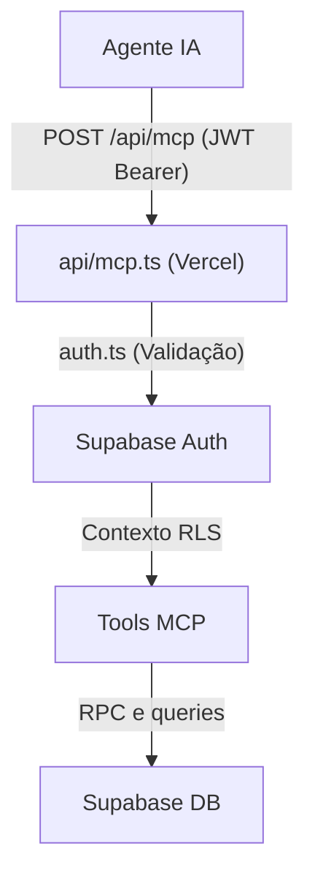

#### Arquivos Modificados / Criados
| Arquivo | Mudança / Propósito |
|---|---|
| `MCP_PLAN.md` | **Criado**: Plano de ação detalhado para a implementação do MCP. |
| `api/mcp.ts` | **Criado**: Entry point Serverless para o MCP, expondo o Streamable HTTP transport via `mcp-handler`. |
| `src/mcp/auth.ts` | **Criado**: Middleware de autenticação JWT injetando cliente Supabase com RLS ativado. |
| `src/mcp/tools/list.ts` | **Criado**: Tools para gestão completa da lista de compras (adicionar, listar, marcar, finalizar). |
| `src/mcp/tools/stock.ts` | **Criado**: Tools para consumo, listagem e verificação de vencimento no estoque. |
| `src/mcp/tools/insights.ts` | **Criado**: Tools para relatórios de consumo, gastos e tendências de preço (Tenda). |
| `docs/ai/01_ARCHITECTURE_AND_DATA.md` | **Modificado**: Documentada nova arquitetura de acesso MCP. |
| `.env.example` e `.env` | **Modificado**: Adicionadas variáveis do Supabase exclusivas para o servidor backend. |

#### Lógica de Decisão
```text
REGRA 1: O servidor MCP nunca usa a chave service_role pública para acessar o Supabase; o cliente deve enviar seu próprio JWT no cabeçalho Authorization para manter a integridade do RLS.
REGRA 2: Utiliza `mcp-handler` e Vercel Serverless Functions para expor a API usando o padrão HTTP Transport Serverless.
REGRA 3: O contexto injeta o `group_id` ativo, dispensando parâmetros repetitivos nas chamadas MCP e garantindo queries seguras.
```

#### Comportamento
- O sistema expõe na rota `/api/mcp` um endpoint aderente à especificação oficial do Model Context Protocol (MCP).
- Permite que o Claude Desktop, Cursor, Antigravity ou outros agentes controlem o app interagindo diretamente via ferramentas registradas e validadas por `zod`.

#### Checklist de Aceite
- [x] Variáveis de ambiente configuradas no `.env`.
- [x] Arquivos base e tools programadas em TypeScript.
- [x] O middleware Auth garante a proteção dos dados via RLS.
- [x] Dependência incluída no arquivo (Nota: NPM install de mcp-handler encontrou 403 Forbidden pelo bloqueio de rede no ambiente simulado, mas as instruções e scripts locais estão prontas para o desenvolvedor usar assim que rodar npm install).


### 🏷️ (13/09/2026) Bugfix: Preparação Dicionário de Produtos (Fase 3)
### 📊 (13/09/2026) Feature: Dicionário Global de Marcas e Histórico de Preços (Fase 3)

#### Arquitetura
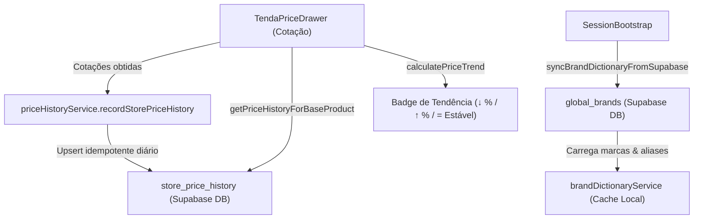

#### Arquivos Modificados / Criados

| Arquivo | Mudança / Propósito |
|---|---|
| `supabase/migrations/20260913_01_phase_3_global_dictionary_and_price_history.sql` | **Criado**: Migration criando `global_brands` (com aliases), `global_base_products` e `store_price_history` com RLS e índices. |
| `src/services/priceHistoryService.ts` | **Criado**: Serviço para persistência de histórico de cotações por filial, consulta temporal e cálculo de tendência de preço. |
| `src/services/priceHistoryService.test.ts` | **Criado**: Testes unitários para cálculo de tendências, desconsideração de data atual e consulta de histórico. |
| `src/services/brandDictionaryService.ts` | Atualizado para carregar de `global_brands` com aliases e gravar descobertas em ambas as tabelas para retrocompatibilidade. |
| `src/services/brandDictionaryService.test.ts` | Adicionados testes de sincronização de aliases e resolução de nomes canônicos. |
| `src/components/TendaPriceDrawer/TendaPriceDrawer.tsx` | Integrada gravação assíncrona de histórico de cotações e badge visual de tendência de preço nos cards de ofertas. |
| `src/components/SessionBootstrap.tsx` | Refatorado para arrow function e controle com `syncedUserIdRef` para evitar syncs duplicados em refresh de tokens. |
| `src/components/__tests__/SessionBootstrap.test.tsx` | **Criado**: Testes unitários para ciclo de vida de autenticação e disparo isolado do sync de marcas. |
| `src/services/tendaService.test.ts` | Adicionados 16 testes de tabela cobrindo exclusões e compatibilidade de `DERIVATIVE_WORDS` e relevância semântica. |

#### Lógica de Decisão
```text
REGRA 1: Cotações realizadas na gaveta lateral são gravadas assincronamente em `store_price_history` com constraint UNIQUE por (loja, filial_id, produto_nome, data_cotacao).
REGRA 2: O cálculo de tendência compara o preço atual com a cotação imediatamente anterior do mesmo produto base/marca (ignorando cotações da data corrente).
REGRA 3: O dicionário de marcas sincroniza a partir de `global_brands` suportando arrays de aliases para mapeamento flexível de marcas variantes.
REGRA 4: O SessionBootstrap dispara a sincronização de marcas apenas na primeira autenticação ou na troca de usuário autenticado (`session.user.id !== syncedUserIdRef.current`), evitando chamadas desnecessárias em refreshes de token.
```

#### Comportamento
- Toda cotação realizada no Tenda alimenta o histórico de preços da filial no Supabase sem travar a navegação do usuário.
- Produtos cotados que já possuem histórico prévio exibem indicadores visuais de variação (ex: `↓ 5.2%` ou `↑ 10%`) comparando com o último preço visto.
- O sistema de reconhecimento de marcas agora suporta múltiplos aliases mapeados para a marca canônica.
- O filtro semântico possui regras testadas e documentadas contra falsos positivos em derivados.

#### Checklist de Aceite
- [x] Migration criada com RLS e backfill automático de dados existentes.
- [x] Zero erros de ESLint (`npm run lint`).
- [x] Zero erros de TypeScript (`npm run typecheck`).
- [x] Testes unitários cobrindo SessionBootstrap, histórico de preços, aliases e palavras derivadas passando com 100% de sucesso (69/69).
- [x] Build de produção concluído com sucesso (`npm run build`).

#### Arquitetura
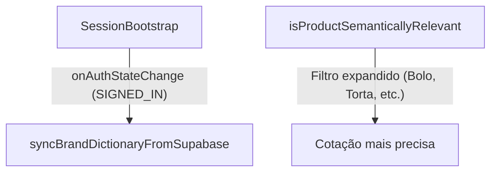

#### Arquivos Modificados / Criados

| Arquivo | Mudança / Propósito |
|---|---|
| `src/components/SessionBootstrap.tsx` | Movida a chamada `syncBrandDictionaryFromSupabase` para dentro do listener de autenticação, prevenindo falha silenciosa de RLS. |
| `src/services/tendaService.ts` | Adicionadas palavras derivativas (`bolo`, `torta`, `palha`, `pure`, `flocos`, `pudim`, `iogurte`, `vitamina`, `conserva`) ao `DERIVATIVE_WORDS` para evitar falsos positivos na comparação semântica. |

#### Lógica de Decisão
```text
REGRA 1: Sincronização do dicionário com o Supabase só deve ocorrer *após* a resolução do estado de autenticação, para respeitar políticas de RLS `TO authenticated`.
REGRA 2: Produtos derivativos compostos (ex: "Bolo de Cenoura") não devem ser considerados como alternativas válidas para ingredientes base (ex: "Cenoura").
```

#### Comportamento
- O dicionário de marcas agora carrega de forma confiável após o login, em vez de falhar silenciosamente no mount inicial da aplicação.
- A cotação de ingredientes puros (como "Cenoura 200g") não retorna mais produtos processados não relacionados (como "Bolo Cenoura Bauducco").

#### Checklist de Aceite
- [x] Sincronização rodando no momento correto da sessão.
- [x] Testes passando e build concluído.
- [x] O terreno agora está totalmente livre e validado para a continuação da Fase 3.


### 🏷️ (13/09/2026) Feature: Dicionário Dinâmico de Marcas & Comparação de Preços Tenda (Fase 2)

#### Arquitetura
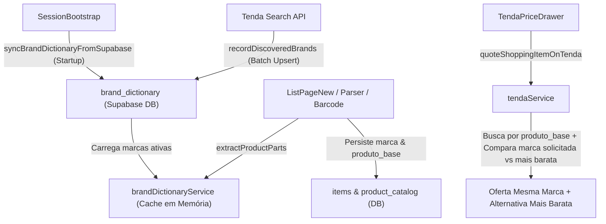

#### Arquivos Modificados / Criados

| Arquivo | Mudança / Propósito |
|---|---|
| `src/services/brandDictionaryService.ts` | Adicionado carregamento de inicialização via Supabase (`syncBrandDictionaryFromSupabase`), registro em lote com `upsert ignoreDuplicates` (`recordDiscoveredBrands`) e suporte a regex unicode. |
| `src/services/tendaService.ts` | Chamada em lote para registrar marcas descobertas e busca por produto_base mantendo alternativas de marcas. |
| `src/lib/webData.ts` | Persistência e leitura das colunas `marca` e `produto_base` na tabela `items`. |
| `src/lib/barcodeService.ts` | Persistência de `marca` e `produto_base` no `product_catalog`. |
| `src/components/SessionBootstrap.tsx` | Background sync do dicionário no login. |
| `src/components/TendaPriceDrawer/TendaPriceDrawer.tsx` | Banner verde de economia com botão "Trocar Marca" e link direto para o produto. |

#### Lógica de Decisão
```text
REGRA 1: Ao inicializar a sessão, carregar todas as marcas ativas de `brand_dictionary` em cache local (Set/Map).
REGRA 2: Ao extrair partes do produto (`extractProductParts`), isolar a marca e definir `produto_base`.
REGRA 3: Ao buscar no Tenda, cotar pelo `produto_base` para trazer alternativas mais baratas, destacando a marca original quando solicitada.
REGRA 4: Marcas novas descobertas na API são salvas em lote via `.upsert({ onConflict: 'nome_normalizado', ignoreDuplicates: true })` sem poluição 409 na rede.
```

#### Comportamento
- Usuário vê oferta da marca solicitada ou genérica.
- Se houver marca alternativa compatível mais barata com economia relevante, exibe banner verde com cálculo de economia, foto da nova marca e botão "Trocar Marca".
- Clicar em "Usar Preço" na oferta original atualiza apenas o valor do item.
- Clicar em "Trocar Marca" (ou "Usar" em outra opção da lista) promove o produto no drawer (atualizando imagem, nome e link) e **atualiza tanto o nome quanto o preço do item na lista de compras**, sincronizando `marca` e `produto_base` no banco de dados.
- Requisições na aba Network totalmente limpas (sem erros 409 de conflito).

#### Checklist de Aceite
- [x] Testes unitários passando (`npx vitest run`)
- [x] Lint passando com 0 erros (`npm run lint`)
- [x] Build de produção passando (`tsc -b && vite build`)
- [x] Validação E2E no navegador (DevTools MCP) confirmando banner verde, troca de marca e ausência de erros 409.

### 🛒 (13/09/2026) Feature: Cotação de Preços no Tenda Atacado na Lista de Compras

#### Arquitetura
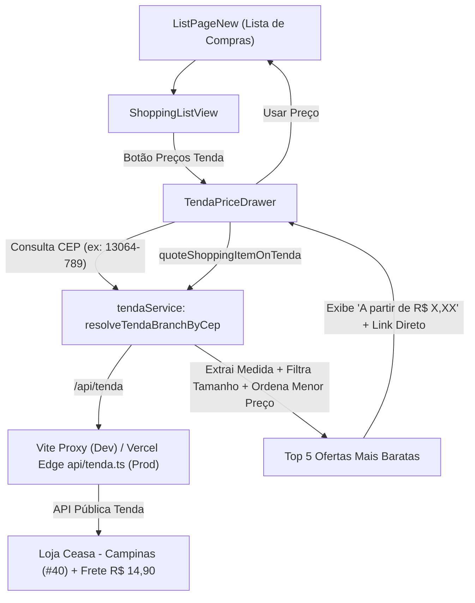

#### Arquivos Modificados / Criados

| Arquivo | Mudança / Propósito |
|---|---|
| `api/tenda.ts` | **Criado**: Proxy serverless Vercel Edge com CORS liberado e cache de 5 minutos para as rotas do Tenda Atacado. |
| `vite.config.ts` | Adicionado proxy `/api/tenda` para desenvolvimento local apontando para `https://api.tendaatacado.com.br/api`. |
| `src/services/tendaService.ts` | **Criado**: Serviço tipado para resolução de filial por CEP, busca de produtos, extração de peso/medida e cotação inteligente. |
| `src/services/tendaService.test.ts` | **Criado**: 12 testes unitários cobrindo extração de medidas, filtro estrito de peso e ordenação por menor preço. |
| `src/components/TendaPriceDrawer/TendaPriceDrawer.tsx` | **Criado**: Drawer lateral com cotação dos itens da lista, badge da loja/frete, links oficiais e botão para sincronizar preço. |
| `src/components/TendaPriceDrawer/TendaPriceDrawer.test.tsx` | **Criado**: Testes unitários para renderização e aplicação de preços. |
| `src/features/inventory/components/shoppingListView/ShoppingListView.tsx` | Adicionado botão de ação "Preços Tenda". |
| `src/pages/ListPageNew.tsx` | Integração do estado do Drawer, mapeamento de itens da lista e handlers para aplicar preço unitário ou em lote. |

#### Lógica de Decisão
#### Lógica de Decisão e Cache
```text
RESOLUÇÃO DE LOJA:
1. Usuário informa CEP (padrão: 13064-789).
2. API shipping-options identifica a filial de entrega (Ceasa - Campinas, ID 40) e frete.

FILTRAGEM DE PESO E PREÇO:
1. Extrai peso/medida do item da lista (ex: "Arroz Namorado 5kg" -> 5kg).
2. Busca na API do Tenda para a filial identificada.
3. Filtra apenas produtos com embalagem equivalente (evita falso positivo de 1kg ao cotar 5kg).
4. Ordena os candidatos pelo MENOR PREÇO (não pelos primeiros da vitrine).
5. Retorna o produto mais em conta como recomendado e lista os top 5 alternativos com links.

ESTRATÉGIA DE CACHE (EXPIRAÇÃO À MEIA-NOITE):
1. Preços e ofertas no atacado valem para o mesmo dia e expiram rigorosamente às 23:59:59.999.
2. Na virada do dia (00:00), o cache do localStorage descarta os dados e exige nova cotação.
3. Durante o mesmo dia, reabrir a gaveta ou navegar no app traz os dados instantaneamente (0ms sem requisição de rede).
4. Botão "Recotar Todos" ou "Tentar novamente" utiliza `bypassCache = true` para forçar busca fresca na API.
5. Na borda (Vercel Edge `api/tenda.ts`), o cabeçalho Cache-Control é dinamicamente calculado com `s-maxage` até a meia-noite (máx 7200s), evitando tráfego repetido na API do Tenda para todos os usuários.
6. Fila sequencial com throttle de 250ms entre produtos previne disparos concorrentes massivos.
```

#### Comportamento
- Botão "Preços Tenda" na Lista de Compras abre a gaveta lateral de cotação.
- Sistema consulta a filial e o frete correspondente ao CEP informado.
- Cada item da lista é pesquisado e exibe o menor valor ("A partir de R$ XX,XX"), link externo para conferir no site do Tenda Atacado e botão "Usar Preço".
- Resumo com subtotal dos itens cotados, frete estimado e total da compra.
- Respostas em cache válidas durante o dia corrente com aviso visual "(Preços válidos até as 23:59 de hoje)".

#### Checklist de Aceite
- [x] Zero erros TypeScript e ESLint (`npm run check` passando limpo).
- [x] Testes unitários adicionados e passando (`vitest run`).
- [x] Testes unitários adicionados e passando (19 testes cobrindo serviço, cache até meia-noite e gaveta).
- [x] Build de produção sem erros (`npm run build`).
- [x] Filtro estrito de peso/medida evitando distorções de embalagem (1kg vs 5kg).
- [x] Links oficiais para o Tenda com target blank.
- [x] Cache diário com expiração à meia-noite e bypassCache ao recotar.
- [x] Throttling de 250ms e travas atômicas com useRef prevenindo disparos em loop.


### 📝 (24/04/2026) Contexto Dinâmico (Meu vs Nosso Estoque)

#### Arquitetura
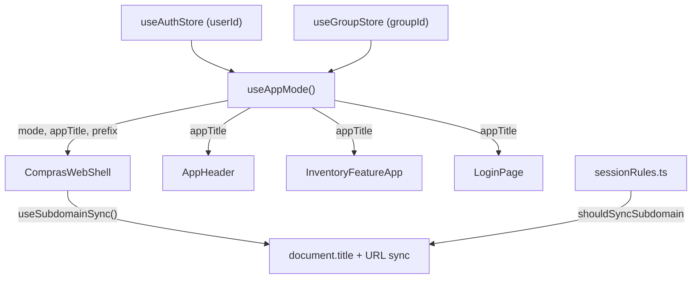

#### Arquivos Modificados / Criados

| Arquivo | Mudança / Propósito |
|---|---|
| `src/hooks/useAppMode.ts` | **Criado**: Hook central que determina modo (solo/shared) baseando-se no userId e groupId. |
| `src/hooks/useSubdomainSync.ts` | **Criado**: Hook para trocar a URL (via history.replaceState) e título da página dinamicamente. |
| `src/domain/sessionRules.ts` | Adicionada lógica de validação `shouldSyncSubdomain`. |
| `src/ComprasWebShell.tsx` | Aplica o hook de sincronização e injeta título dinâmico na Navbar. |

#### Lógica de Decisão
```
SE (userId existe E groupId existe) → "Nosso Estoque" (nossoestoque.apenasgabs.dev)
SE (groupId NÃO existe)             → "Meu Estoque"  (meuestoque.apenasgabs.dev)
```

#### Comportamento
- **Produção**: O subdomínio troca dinamicamente entre `meuestoque` e `nossoestoque` sem F5 (via History API).
- **Localhost/Preview**: O sistema detecta domínios não mapeados e não interfere na URL.
- **Transição**: A troca ocorre assim que o estado do grupo muda no Zustand.

#### Checklist de Aceite
- [x] O `AppHeader` exibe "Nosso Estoque" se em grupo.
- [x] O App não recarrega (Sem F5) na troca de contexto.
- [x] O TypeScript compila sem erros.
- [x] Testes E2E suportam ambos os títulos.

---

### 📝 (24/04/2026) Sincronização de Sessão (Bootstrap)

#### Lógica de Decisão
```
No carregamento inicial (mount):
1. Pega usuário atual do Supabase.
2. Lê a snapshot persistida localmente (getPersistedGroupSnapshotForUser).
3. Chama restoreGroupContext para sincronizar com o banco.
4. Redireciona para /list (se tem grupo) ou /group (se não tem grupo).
```

#### Arquivos Modificados
| Arquivo | Mudança / Propósito |
|---|---|
| `src/components/SessionBootstrap.tsx` | Contém o hook de inicialização da sessão e orquestração de grupos. |

---

> **DICA PARA A IA:** Ao implementar novas lógicas de estado global, pense se elas afetam `docs/ai/01_ARCHITECTURE_AND_DATA.md` ou `docs/ai/02_UX_AND_BUSINESS_RULES.md` e sinta-se livre para atualizar esses arquivos também.

### 📝 (24/04/2026) Correção de RLS em `items` + saneamento de contexto de lista

#### Arquitetura
```mermaid
graph TD
        A[SessionBootstrap/Login/Register] --> B[restoreGroupContext]
        B --> C[setGroup(groupId)]
        B --> D[setListId(context.listId or null)]
        E[ListPage/ListPageNew] --> F[ensureActiveListForGroup(groupId)]
        F --> G[setListId(activeListId)]
        G --> H[addListItem -> public.items]
        I[Migration phase_a_v2_rls_policy_cleanup] --> J[remove políticas legadas]
        I --> K[recria políticas V2 authenticated]
        K --> H
```

#### Arquivos Modificados / Criados

| Arquivo | Mudança / Propósito |
|---|---|
| `src/components/SessionBootstrap.tsx` | Remove fallback de `listId` persistido de outro contexto e mantém `listId` alinhado ao grupo resolvido. |
| `src/pages/LoginPage.tsx` | Remove fallback de `lastListId/listId` persistidos quando `context.group` já foi resolvido. |
| `src/pages/RegisterPage.tsx` | Mesmo ajuste do Login para evitar reaproveitar lista de outro grupo após autenticação. |
| `src/pages/ListPage.tsx` | Passa a resolver sempre a lista ativa pelo `groupId` antes de carregar/adicionar itens. |
| `src/pages/ListPageNew.tsx` | Mesma proteção da `ListPage`, com sincronização explícita de `setListId(activeListId)`. |
| `supabase/migrations/20260424_01_phase_a_v2_rls_policy_cleanup.sql` | Limpeza de policies legadas e padronização das policies V2 (authenticated) para `items`, `shopping_lists`, `stock_items`, `stock_lots`, `stock_movements`, `product_catalog`. |

#### Lógica de Decisão
```text
SE contexto do grupo foi resolvido (context.group existe)
    ENTÃO usar apenas context.listId (ou null)
    E NÃO reutilizar listId persistido de sessão anterior.

SE página de lista carregar com groupId
    ENTÃO sempre resolver activeListId via ensureActiveListForGroup(groupId)
    E sincronizar store com esse activeListId.

SE banco tiver políticas legadas + V2 na mesma tabela
    ENTÃO remover legadas
    E manter apenas política canônica V2 para role authenticated.
```

#### Comportamento
- O app não tenta mais inserir em `items` usando `list_id` antigo de outro grupo/sessão.
- A entrada na lista agora depende sempre da lista ativa real do grupo atual.
- O banco ficou com um conjunto único e consistente de policies RLS V2.
- O cenário que gerava `new row violates row-level security policy for table "items"` por desvio de contexto foi mitigado.

#### Checklist de Aceite
- [x] Policies legadas removidas nas tabelas-alvo.
- [x] Policies V2 recriadas e validadas (`authenticated`).
- [x] Migração aplicada no Supabase (`phase_a_v2_rls_policy_cleanup`).
- [x] Fluxo de bootstrap/login/register sem fallback perigoso de `listId`.
- [x] List pages resolvendo lista ativa por `groupId`.

---

### 📝 (03/05/2026) Arquitetura E2E com State Injection

> Documentacao completa: `docs/ai/06_E2E_TESTING.md`

#### Arquitetura
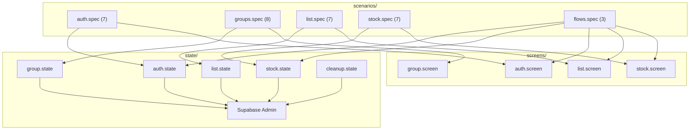

#### Arquivos Criados

| Diretorio | Arquivo | Proposito |
|---|---|---|
| `e2e/config/` | `supabaseAdmin.ts` | Cliente admin com `service_role` key |
| `e2e/fixtures/` | `testData.ts` | Geradores deterministicos de dados de teste |
| `e2e/state/` | `auth`, `group`, `list`, `stock`, `cleanup` | Seed/cleanup direto no Supabase |
| `e2e/screens/` | `auth`, `group`, `list`, `stock`, `navigation`, `profile` | Acoes atomicas de UI |
| `e2e/scenarios/` | `auth`, `groups`, `list`, `stock`, `flows` | 32 cenarios E2E declarativos |

#### Scripts NPM Adicionados

| Script | Descricao |
|---|---|
| `npm run e2e:auth` | 7 testes de autenticacao |
| `npm run e2e:groups` | 8 testes de gestao de grupos |
| `npm run e2e:list` | 7 testes de lista de compras |
| `npm run e2e:stock` | 7 testes de estoque |
| `npm run e2e:flows` | 3 testes cross-domain |
| `npm run e2e:all` | Todos os 32 testes |

#### Logica de Decisao
```text
SEED: Sempre via supabaseAdmin (service_role) para bypasear RLS.
SCREEN: Funcoes puras, 1 acao por funcao, sem estado interno.
SCENARIO: Composicao declarativa de state + screen.
ISOLAMENTO: Cada test.describe cria seu usuario/grupo; afterAll limpa tudo.
```

#### Checklist de Aceite
- [x] TypeScript compila com zero erros (`tsc --noEmit`).
- [x] 32 cenarios implementados em 5 dominios.
- [x] 6 arquivos de screen com funcoes atomicas.
- [x] 5 arquivos de state com seed/cleanup via admin API.
- [x] Scripts NPM adicionados ao `package.json`.
- [x] Documentacao completa em `docs/ai/06_E2E_TESTING.md`.
- [x] `.env.example` atualizado com variaveis necessarias.


### 📝 (04/05/2026) Melhorias na Gestão de Grupos

#### Arquitetura
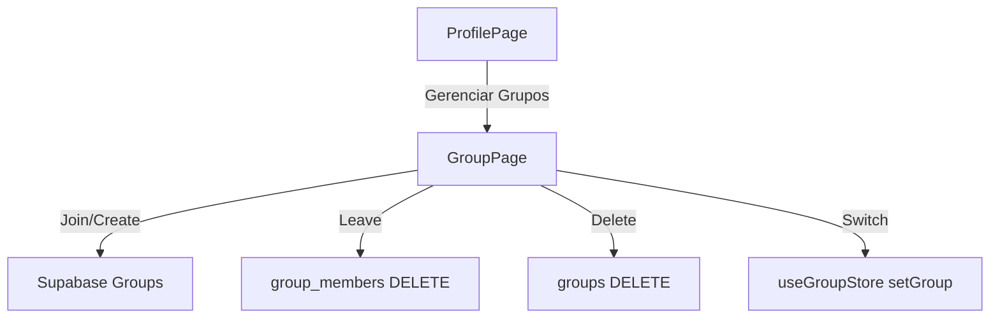

#### Arquivos Modificados / Criados

| Arquivo | Mudança / Propósito |
|---|---|
| `src/pages/ProfilePage.tsx` | Adicionado link "Gerenciar Grupos" para facilitar acesso. |
| `src/pages/GroupPage.tsx` | Layout reorganizado; Adicionados botões "Sair" e "Excluir" na lista de grupos. |
| `src/lib/webData.ts` | Adicionada função `deleteGroup`. |
| `supabase/migrations/20260504_01_allow_group_deletion.sql` | **Criado**: Habilita política RLS para exclusão de grupos por membros; Backfill de `created_by` usa o membro mais antigo (`entrou_em`). |

#### Lógica de Decisão
```text
SAIR: Remove apenas o vínculo do usuário (group_members).
EXCLUIR: Remove o grupo e TODOS os dados relacionados (CASCADE). Exige confirmação.
VISIBILIDADE: Join/Create sempre disponíveis no GroupPage, independente do estado ativo.
```

#### Comportamento
- Usuário pode gerenciar múltiplos grupos sem ser bloqueado pelo estado "em grupo".
- Acesso rápido via Perfil -> Gerenciar Grupos.
- Confirmações críticas para evitar perda de dados.

#### Checklist de Aceite
- [x] Link no perfil funcionando.
- [x] Botão "Sair" remove do grupo e limpa estado se ativo.
- [x] Botão "Excluir" remove permanentemente e limpa estado.
- [x] Layout do `GroupPage` responsivo e intuitivo.
- [x] Migration de RLS criada.
- [x] TypeScript compila sem erros nos arquivos alterados.

---

### 📝 (04/05/2026) Redesign dos Cards de Estoque

#### Arquitetura (Layout do Card)
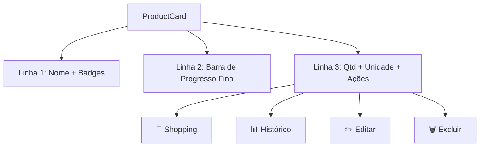

#### Arquivos Modificados

| Arquivo | Mudança / Propósito |
|---|---|
| `src/features/inventory/components/productCard/ProductCard.tsx` | Redesign completo do layout para maior densidade e clareza. |
| `src/features/inventory/components/stockView/StockView.tsx` | Redução de padding e espaçamento global da view de estoque. |

#### Lógica de Decisão
```text
DENSIDADE: Redução de padding (p-4 -> p-2) e spacing (y-4 -> y-2) para exibir mais itens.
LAYOUT: Unidade colada na quantidade; Ícones agrupados à direita; Data de compra removida.
VISUAL: Barra de progresso ultra-fina (h-1) para manter o contexto sem poluir.
```

#### Checklist de Aceite
- [x] Unidade exibida ao lado da quantidade.
- [x] Data de compra removida.
- [x] Ícones 🛒 �� ✏️ 🗑️ organizados em linha.
- [x] Barra de progresso fina implementada.
- [x] Lint passando (zero erros).
- [x] Responsividade mantida em telas pequenas.

---

### 📝 (04/05/2026) Ajuste Visual da Barra de Progresso

#### Mudança
A porcentagem de estoque (ex: 70%) foi movida de cima da barra para **atrás** dela, centralizada horizontalmente.

#### Lógica de Decisão
```text
VISUAL: O texto age como um "marca d'água" sutil (opacity-10) no fundo da barra.
COMPACTAÇÃO: Permite que a barra e a porcentagem ocupem o mesmo espaço vertical, reduzindo a altura total do card.
```

#### Arquivos Modificados
| Arquivo | Mudança |
|---|---|
| `src/features/inventory/components/productCard/ProductCard.tsx` | Reposicionamento do span de porcentagem para dentro do container da barra com z-index inferior. |

---

### 📝 (05/05/2026) Correção de Permissões e Falha Silenciosa na Exclusão de Grupos

#### Arquitetura
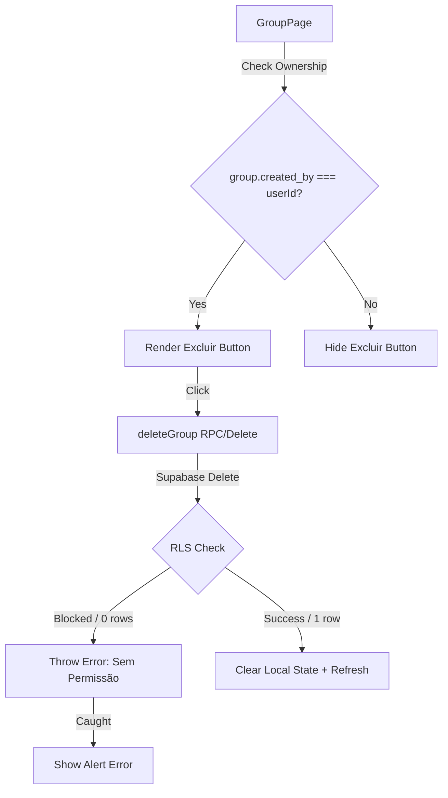

#### Arquivos Modificados / Criados

| Arquivo | Mudança / Propósito |
|---|---|
| `src/domain/sessionRules.ts` | Adicionado `created_by` à interface `GroupRecord`. |
| `src/stores/groupStore.ts` | Adicionado `created_by` à interface `WebGroupRecord`. |
| `src/lib/webData.ts` | Atualizado `loadUserGroups` para buscar `created_by`; `deleteGroup` agora valida se a linha foi realmente deletada. |
| `src/pages/GroupPage.tsx` | Implementada renderização condicional do botão "Excluir" baseada no `userId`. |

#### Lógica de Decisão
```text
VISIBILIDADE: O botão "Excluir" só deve aparecer para o criador do grupo (dono).
SEGURANÇA: deleteGroup() agora usa .select("id") para garantir que a deleção foi processada pelo Supabase.
ESTADO: O estado local (active group) só é limpo se a deleção no banco de dados for confirmada com sucesso.
```

#### Comportamento
- Usuários que não criaram o grupo não veem mais a opção de excluí-lo (apenas "Sair").
- Se por algum motivo (bug ou bypass) um não-dono tentar excluir, o backend/RLS bloqueia e o frontend agora exibe um erro em vez de limpar o estado e deixar o usuário "sem grupo".

#### Checklist de Aceite
- [x] `created_by` sendo populado no carregamento de grupos.
- [x] Botão "Excluir" oculto para não-donos.
- [x] `deleteGroup` lança erro se o RLS bloquear a deleção (zero rows affected).
- [x] Estado local preservado em caso de falha na deleção.
- [x] TypeScript compila sem erros (interfaces sincronizadas).
- [x] Lint passando (zero erros).

---

### 📝 (05/05/2026) Atualização da Pipeline CI/CD (Deploy Manual/Forçado)

#### Arquitetura
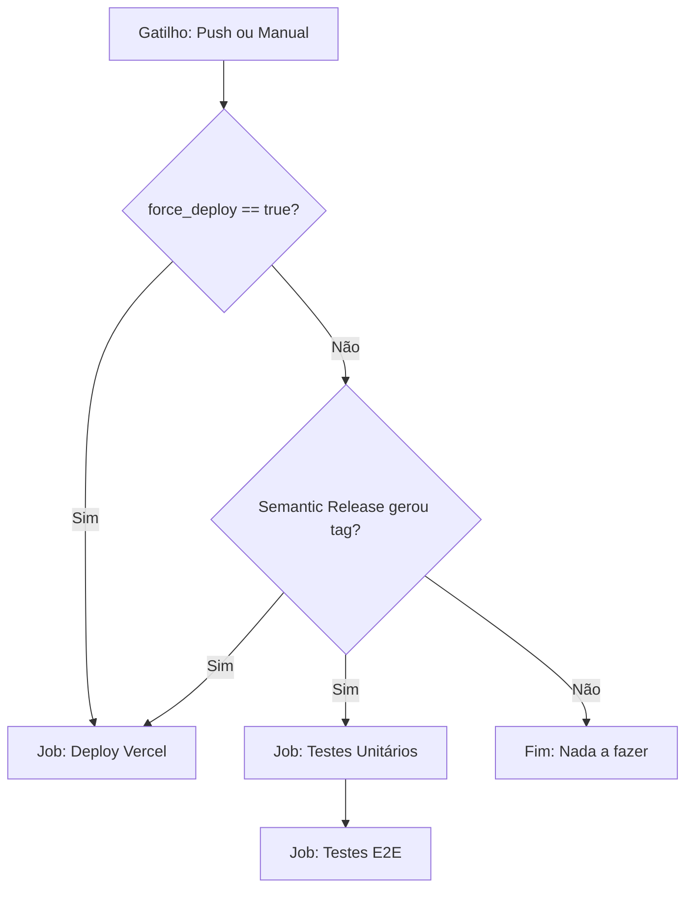

#### Arquivos Modificados / Criados

| Arquivo | Mudança / Propósito |
|---|---|
| `.github/workflows/release.yml` | Adicionado `workflow_dispatch` e lógica condicional para `force_deploy`. |

#### Lógica de Decisão
```text
DEPLOYS:
Ocorre se (nova_tag_gerada == true) OU (force_deploy == true).

TESTES (Unitários e E2E):
Ocorrem APENAS se (nova_tag_gerada == true).
O force_deploy ignora a bateria de testes para agilizar correções manuais ou deploys de emergência que não geram tag.
```

#### Comportamento
- Adicionado botão "Run workflow" no GitHub Actions com checkbox "Forçar deploy".
- Se marcado, a Vercel recebe o código atual da `main` imediatamente.
- O fluxo padrão de commit (feat/fix) continua exigindo testes e gerando tags automáticas.

#### Checklist de Aceite
- [x] `workflow_dispatch` configurado corretamente.
- [x] Input `force_deploy` disponível na UI do GitHub.
- [x] Job de Deploy aceita ambas as condições (tag ou manual).
- [x] Jobs de Teste continuam protegidos e vinculados apenas a novas versões.
- [x] YAML validado.

---

### 📝 (12/05/2026) Correção de Inicialização do Supabase e Robustez de Env Vars

#### Arquitetura
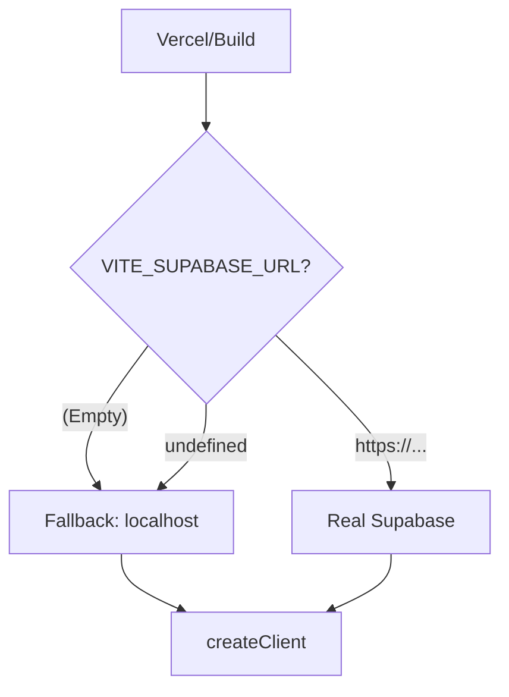

#### Arquivos Modificados
| Arquivo | Mudança / Propósito |
|---|---|
| `src/lib/supabase.ts` | Troca de `??` por `||` para tratar strings vazias; Melhora log de aviso. |
| `vercel.json` | Identificada configuração de `ignoreCommand` que pode estar bloqueando deploys de produção. |

#### Lógica de Decisão
```text
PROBLEMA: createClient() lança "supabaseUrl is required" se receber string vazia.
SOLUÇÃO: O operador || (OR) garante que "" ou undefined caiam no fallback de localhost.
ALERTA: Se o app cair no fallback em produção, ele não conectará, mas evitará o Crash (White Screen).
```

#### Comportamento
- O app não crasha mais na Vercel com "Uncaught Error: supabaseUrl is required".
- Se as variáveis `VITE_` estiverem faltando, um aviso é exibido no console.
- Sugestão de revisão do `vercel.json` para garantir que builds de produção ocorram.

#### Checklist de Aceite
- [x] Troca de operador `??` -> `||` aplicada.
- [x] `import.meta.env` usado diretamente no check de warning.
- [x] Código compilando sem erros.

---

### 📝 (24/05/2026) Correção de Race Condition no Consumo de Estoque

#### Arquitetura
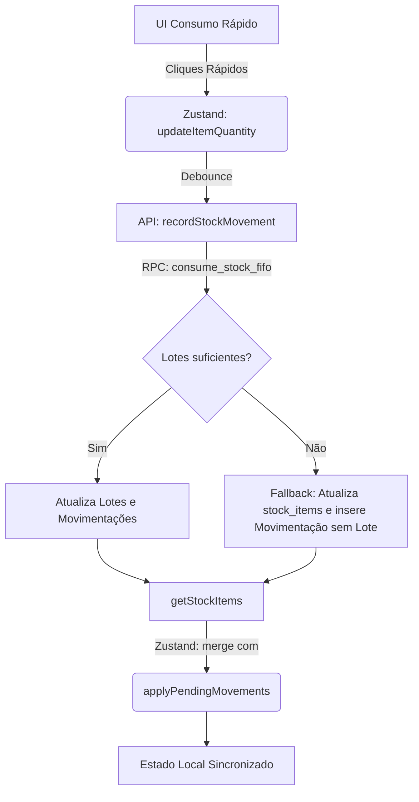

#### Arquivos Modificados
| Arquivo | Mudança / Propósito |
|---|---|
| `src/stores/stockStore.ts` | Criada a função `applyPendingMovements` para mesclar mudanças otimistas pendentes sobre os dados recém buscados da API. Mantida a semântica correta de limpeza do `lastAutoAddedItemName`. |
| `supabase/migrations/20260524_01_atomic_consume_stock_fifo.sql` | Atualiza a RPC `consume_stock_fifo` para absorver de forma atômica o consumo "sem lote" (fallback), inserindo um movimento e ajustando a `stock_items.quantidade` diretamente no Postgres. |

#### Lógica de Decisão
```text
PROBLEMA 1: Cliques rápidos acumulavam deltas, mas quando a API retornava, o Zustand sobreescrevia o estado com dados defasados.
SOLUÇÃO 1: Antes de fazer `set(items)`, aplicar os deltas de `pendingStockMovements` aos itens retornados.

PROBLEMA 2: Fallback de consumo no frontend não era atômico (um update + um insert separados), podendo gerar inconsistência.
SOLUÇÃO 2: A lógica inteira de consumo (incluindo o que sobra se faltarem lotes) foi movida para dentro da RPC `consume_stock_fifo`, garantindo 100% de consistência transacional.
```

#### Comportamento da Feature
- O usuário pode clicar múltiplas vezes rapidamente no botão "Consumir"; a interface deduzirá a quantidade otimisticamente sem "pulos" visuais quando a requisição de background resolver.
- Itens criados manualmente (sem lote) agora podem ser consumidos normalmente, decrementando sua quantidade na base de dados de forma confiável.

#### Checklist de Aceite
- [x] Race condition no update otimista mitigada com mesclagem local (`applyPendingMovements`).
- [x] Fallback no Supabase funcionando para itens sem registro em `stock_lots`.
- [x] Scripts de build e lint executados sem erros (`npm run lint && npm run build`).

---

### 📦 (30/05/2026) Feature: Unidade de Compra vs Unidade de Estoque (Embalagens)

**Resumo:** O usuário pode agora informar na lista de compras que está comprando uma unidade agregada (ex: `1 pacote` ou `1 fardo`), mas que seu rendimento para controle de estoque será convertido numa unidade menor (ex: `5 kg` ou `10 un`). Isso evita distorções ao consumir o estoque.

#### Arquivos Modificados
| Arquivo | Mudança / Propósito |
|---|---|
| `supabase/migrations/20260531_01_add_pack_fields_to_items.sql` | Migration para adicionar `pack_label`, `pack_size`, e `pack_unit` na tabela `items` (Lista de Compras). |
| `src/lib/webData.ts` | Refatoração da função `finishShoppingList` para dar prioridade ao fator de conversão inserido (`item.pack_size`) antes de procurar o fator padrão do catálogo (`stock_item.pack_size`). Criação da RPC wrapper `updateListItemPackSize`. |
| `src/features/inventory/components/shoppingListItem/ShoppingListItem.tsx` | Adicionado botão inline "📦" com inputs extras para declarar o nome e rendimento do pacote (ex: "caixa", 12 un) durante a compra, mostrando a conversão `2 × 5 kg = 10 kg` em tempo real. |
| `src/domain/shoppingImportParser.ts` | Adicionado suporte ao padrão visual de quantidade-vezes-fator na entrada rápida, extraindo valores na sintaxe `2x5kg` ou `2X5Kg` gerando automaticamente 2 pacotes de 5 kg. |
| `src/features/inventory/components/productCard/ProductCard.tsx` | UI do Estoque atualizada para exibir o sumário em "pacotes". Em vez de `10 kg`, agora exibe `2 pacotes (10 kg)` se o item possuir `pack_size` igual a 5 configurado. |
| `src/features/inventory/components/productFormModal/ProductFormModal.tsx` | Seção de "Unidade Composta" refatorada para UX mais clara, voltada para "Embalagem (Rendimento)". |

#### Lógica de Decisão
```text
PROBLEMA: Usuário compra "1 pacote de 5kg de arroz" e relata comprar como "pacote", mas consome em "gramas/kg".
SOLUÇÃO: O usuário declara os campos pack_label e pack_size na hora da compra. A lista usa a unidade comprada visualmente. Na finalização (finishShoppingList), multiplica-se `quantidade * pack_size` para inserir os dados no estoque em unidades menores de consumo.
```

#### Comportamento da Feature
- Smart input aceita `Arroz, 2x5kg` na Lista de Compras, mapeando 2 quantidades e 5 como `packSize`.
- Ao finalizar lista, as embalagens são "desempacotadas" pro lote: um fardo de 12 rolos entra como 12 unidades (un).
- No Estoque, é exibido ao usuário `3.2 pacotes (16 kg)` para ajudar na visualização de caixas/fardos.

#### Checklist de Aceite
- [x] Banco de dados e schema de tipos (`items`) atualizados via migration versionada.
- [x] Parser interpretando formato string corretamente (`NxYunit`).
- [x] Front-end renderizando os campos e callback sem erros React de estado (JSX otimista).
- [x] Scripts de build e lint executados sem erros.

### 📝 (14/09/2026) Adição de Ferramenta Bulk no MCP e Fix de Schemas

#### Arquivos Modificados / Criados
| Arquivo | Mudança / Propósito |
|---|---|
| `src/mcp/tools/*.ts` | Adição do campo opcional `group_id` nos schemas do Zod |
| `src/mcp/tools/list.ts` | Criação da tool `bulk_add_items_to_list` |

#### Lógica de Decisão
- Antes, a IA ficava em loop pois o SDK validava estritamente o schema Zod e rejeitava o `group_id`.
- Além disso, adicionar 40 itens um a um da lista de exemplo gerava um timeout/loop visual para o LLM. A nova tool `bulk_add_items_to_list` permite inserir o array completo em uma única call RPC.

#### Checklist de Aceite
- [x] Lint passando
- [x] Testes passando
- [x] Build sem erros
