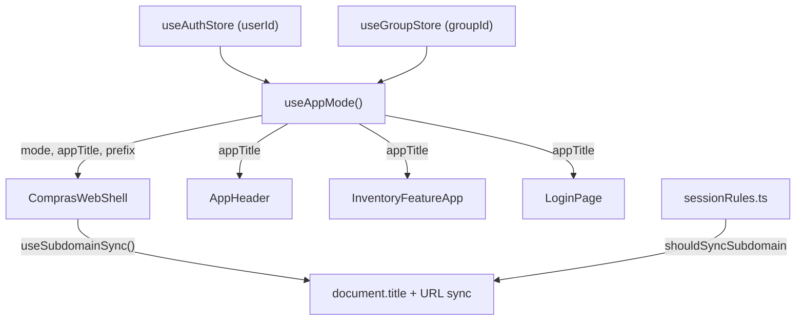

# 🤖 Base de Conhecimento e Log para IAs (AI Knowledge Base)

**ATENÇÃO, IA LENDO ESTE ARQUIVO:** Se você está trabalhando neste projeto, **você DEVE** consultar a documentação listada abaixo antes de alterar o código do sistema e **atualizar este arquivo** sempre que modificar regras ou infraestrutura importante!

## 📖 Como a Documentação está Organizada

Para facilitar a leitura e não estourar seu contexto, quebramos as especificações da aplicação em arquivos menores na pasta `docs/ai/`:

1. 👉 **`.github/copilot-instructions.md`** - Regras gerais, padrões de código, linting, tipos e estilo.
2. 👉 **`docs/ai/01_ARCHITECTURE_AND_DATA.md`** - Detalhes do Supabase, migrations V2 e o fluxo RPC.
3. 👉 **`docs/ai/02_UX_AND_BUSINESS_RULES.md`** - Regras da interface, Chips, Parser de Listas e Unidade Composta.
4. 👉 **`docs/ai/03_COMPONENTS.md`** - Resumo dos nossos componentes UI com Tailwind/daisyUI.

---

## 📜 Regras de Documentação (Padrão Exigido)

**TODA VEZ** que você finalizar uma tarefa que impacta a arquitetura, negócio ou cria novos fluxos, você **DEVE** logar as mudanças aqui usando o seguinte formato estrito:

1. **Gráfico Mermaid**: Para mostrar o fluxo de dados ou a dependência de componentes.
2. **Tabela de Arquivos**: Explicando os arquivos modificados/criados.
3. **Lógica de Decisão**: Bloco de código com a regra ou fluxo em texto puro.
4. **Comportamento**: Resumo em bullet points do que o sistema faz na prática.
5. **Checklist de Aceite**: O que foi garantido que funciona.

---

## 📜 Log Recente de Modificações por IAs

### 📝 (24/04/2026) Contexto Dinâmico (Meu vs Nosso Estoque)

#### Arquitetura


#### Arquivos Modificados / Criados

| Arquivo | Mudança / Propósito |
|---|---|
| `src/hooks/useAppMode.ts` | **Criado**: Hook central que determina modo (solo/shared) baseando-se no userId e groupId. |
| `src/hooks/useSubdomainSync.ts` | **Criado**: Hook para trocar a URL (via history.replaceState) e título da página dinamicamente. |
| `src/domain/sessionRules.ts` | Adicionada lógica de validação `shouldSyncSubdomain`. |
| `src/ComprasWebShell.tsx` | Aplica o hook de sincronização e injeta título dinâmico na Navbar. |

#### Lógica de Decisão
```
SE (userId existe E groupId existe) → "Nosso Estoque" (nossoestoque.apenasgabs.dev)
SE (groupId NÃO existe)             → "Meu Estoque"  (meuestoque.apenasgabs.dev)
```

#### Comportamento
- **Produção**: O subdomínio troca dinamicamente entre `meuestoque` e `nossoestoque` sem F5 (via History API).
- **Localhost/Preview**: O sistema detecta domínios não mapeados e não interfere na URL.
- **Transição**: A troca ocorre assim que o estado do grupo muda no Zustand.

#### Checklist de Aceite
- [x] O `AppHeader` exibe "Nosso Estoque" se em grupo.
- [x] O App não recarrega (Sem F5) na troca de contexto.
- [x] O TypeScript compila sem erros.
- [x] Testes E2E suportam ambos os títulos.

---

### 📝 (24/04/2026) Sincronização de Sessão (Bootstrap)

#### Lógica de Decisão
```
No carregamento inicial (mount):
1. Pega usuário atual do Supabase.
2. Lê a snapshot persistida localmente (getPersistedGroupSnapshotForUser).
3. Chama restoreGroupContext para sincronizar com o banco.
4. Redireciona para /list (se tem grupo) ou /group (se não tem grupo).
```

#### Arquivos Modificados
| Arquivo | Mudança / Propósito |
|---|---|
| `src/components/SessionBootstrap.tsx` | Contém o hook de inicialização da sessão e orquestração de grupos. |

---

> **DICA PARA A IA:** Ao implementar novas lógicas de estado global, pense se elas afetam `docs/ai/01_ARCHITECTURE_AND_DATA.md` ou `docs/ai/02_UX_AND_BUSINESS_RULES.md` e sinta-se livre para atualizar esses arquivos também.
