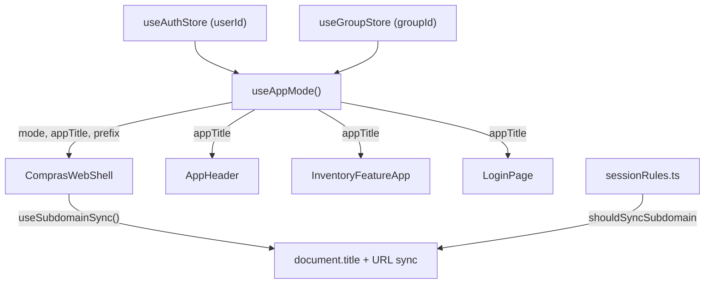

# 🤖 Base de Conhecimento e Log para IAs (AI Knowledge Base)

**ATENÇÃO, IA LENDO ESTE ARQUIVO:** Se você está trabalhando neste projeto, **você DEVE** consultar a documentação listada abaixo antes de alterar o código do sistema e **atualizar este arquivo** sempre que modificar regras ou infraestrutura importante!

## 📖 Como a Documentação está Organizada

Para facilitar a leitura e não estourar seu contexto, quebramos as especificações da aplicação em arquivos menores na pasta `docs/ai/`:

1. 👉 **`.github/copilot-instructions.md`** — Regras gerais, padrões de código, linting, tipos e estilo.
2. 👉 **`docs/ai/01_ARCHITECTURE_AND_DATA.md`** — Arquitetura, Supabase e fluxo RPC.
3. 👉 **`docs/ai/02_UX_AND_BUSINESS_RULES.md`** — UX, Chips, Parser, Unidade Composta, Bulk Mode.
4. 👉 **`docs/ai/03_COMPONENTS.md`** — Componentes UI (Tailwind/daisyUI).
5. 👉 **`docs/ai/04_RPC_CONTRACTS.md`** — Contratos das funções Postgres.
6. 👉 **`docs/ai/05_DATABASE_MAP.md`** — Índice para o ER diagrama em `docs/database_map.md`.
7. 👉 **`docs/ai/feature-*.md`** — Documentação dedicada por feature (ex: `feature-bulk-expiration.md`).

Documentação fora de `docs/ai/`:

- **`README.md`** — overview do projeto e setup rápido.
- **`docs/SETUP.md`** — setup completo com Supabase + migrations.
- **`docs/FEATURES.md`** — visão de produto/funcionalidades.
- **`docs/GLOSSARY.md`** — termos canônicos do domínio.
- **`docs/STACK_DIAGRAM.md`** — visão runtime React → Supabase.
- **`docs/adr/`** — Architectural Decision Records.
- **`docs/internal/`** — espaço para conteúdo não-técnico (interno).

---

## 📜 Regras de Documentação (Padrão Exigido)

**TODA VEZ** que você finalizar uma tarefa que impacta a arquitetura, negócio ou cria novos fluxos, você **DEVE** logar as mudanças aqui usando o seguinte formato estrito:

1. **Gráfico Mermaid**: Para mostrar o fluxo de dados ou a dependência de componentes.
2. **Tabela de Arquivos**: Explicando os arquivos modificados/criados.
3. **Lógica de Decisão**: Bloco de código com a regra ou fluxo em texto puro.
4. **Comportamento**: Resumo em bullet points do que o sistema faz na prática.
5. **Checklist de Aceite**: O que foi garantido que funciona.

---

## 📜 Log Recente de Modificações por IAs

### 📝 (24/04/2026) Contexto Dinâmico (Meu vs Nosso Estoque)

#### Arquitetura


#### Arquivos Modificados / Criados

| Arquivo | Mudança / Propósito |
|---|---|
| `src/hooks/useAppMode.ts` | **Criado**: Hook central que determina modo (solo/shared) baseando-se no userId e groupId. |
| `src/hooks/useSubdomainSync.ts` | **Criado**: Hook para trocar a URL (via history.replaceState) e título da página dinamicamente. |
| `src/domain/sessionRules.ts` | Adicionada lógica de validação `shouldSyncSubdomain`. |
| `src/ComprasWebShell.tsx` | Aplica o hook de sincronização e injeta título dinâmico na Navbar. |

#### Lógica de Decisão
```
SE (userId existe E groupId existe) → "Nosso Estoque" (nossoestoque.apenasgabs.dev)
SE (groupId NÃO existe)             → "Meu Estoque"  (meuestoque.apenasgabs.dev)
```

#### Comportamento
- **Produção**: O subdomínio troca dinamicamente entre `meuestoque` e `nossoestoque` sem F5 (via History API).
- **Localhost/Preview**: O sistema detecta domínios não mapeados e não interfere na URL.
- **Transição**: A troca ocorre assim que o estado do grupo muda no Zustand.

#### Checklist de Aceite
- [x] O `AppHeader` exibe "Nosso Estoque" se em grupo.
- [x] O App não recarrega (Sem F5) na troca de contexto.
- [x] O TypeScript compila sem erros.
- [x] Testes E2E suportam ambos os títulos.

---

### 📝 (24/04/2026) Sincronização de Sessão (Bootstrap)

#### Lógica de Decisão
```
No carregamento inicial (mount):
1. Pega usuário atual do Supabase.
2. Lê a snapshot persistida localmente (getPersistedGroupSnapshotForUser).
3. Chama restoreGroupContext para sincronizar com o banco.
4. Redireciona para /list (se tem grupo) ou /group (se não tem grupo).
```

#### Arquivos Modificados
| Arquivo | Mudança / Propósito |
|---|---|
| `src/components/SessionBootstrap.tsx` | Contém o hook de inicialização da sessão e orquestração de grupos. |

---

> **DICA PARA A IA:** Ao implementar novas lógicas de estado global, pense se elas afetam `docs/ai/01_ARCHITECTURE_AND_DATA.md` ou `docs/ai/02_UX_AND_BUSINESS_RULES.md` e sinta-se livre para atualizar esses arquivos também.

### 📝 (24/04/2026) Correção de RLS em `items` + saneamento de contexto de lista

#### Arquitetura
```mermaid
graph TD
        A[SessionBootstrap/Login/Register] --> B[restoreGroupContext]
        B --> C[setGroup(groupId)]
        B --> D[setListId(context.listId or null)]
        E[ListPage/ListPageNew] --> F[ensureActiveListForGroup(groupId)]
        F --> G[setListId(activeListId)]
        G --> H[addListItem -> public.items]
        I[Migration phase_a_v2_rls_policy_cleanup] --> J[remove políticas legadas]
        I --> K[recria políticas V2 authenticated]
        K --> H
```

#### Arquivos Modificados / Criados

| Arquivo | Mudança / Propósito |
|---|---|
| `src/components/SessionBootstrap.tsx` | Remove fallback de `listId` persistido de outro contexto e mantém `listId` alinhado ao grupo resolvido. |
| `src/pages/LoginPage.tsx` | Remove fallback de `lastListId/listId` persistidos quando `context.group` já foi resolvido. |
| `src/pages/RegisterPage.tsx` | Mesmo ajuste do Login para evitar reaproveitar lista de outro grupo após autenticação. |
| `src/pages/ListPage.tsx` | Passa a resolver sempre a lista ativa pelo `groupId` antes de carregar/adicionar itens. |
| `src/pages/ListPageNew.tsx` | Mesma proteção da `ListPage`, com sincronização explícita de `setListId(activeListId)`. |
| `supabase/migrations/20260424_01_phase_a_v2_rls_policy_cleanup.sql` | Limpeza de policies legadas e padronização das policies V2 (authenticated) para `items`, `shopping_lists`, `stock_items`, `stock_lots`, `stock_movements`, `product_catalog`. |

#### Lógica de Decisão
```text
SE contexto do grupo foi resolvido (context.group existe)
    ENTÃO usar apenas context.listId (ou null)
    E NÃO reutilizar listId persistido de sessão anterior.

SE página de lista carregar com groupId
    ENTÃO sempre resolver activeListId via ensureActiveListForGroup(groupId)
    E sincronizar store com esse activeListId.

SE banco tiver políticas legadas + V2 na mesma tabela
    ENTÃO remover legadas
    E manter apenas política canônica V2 para role authenticated.
```

#### Comportamento
- O app não tenta mais inserir em `items` usando `list_id` antigo de outro grupo/sessão.
- A entrada na lista agora depende sempre da lista ativa real do grupo atual.
- O banco ficou com um conjunto único e consistente de policies RLS V2.
- O cenário que gerava `new row violates row-level security policy for table "items"` por desvio de contexto foi mitigado.

#### Checklist de Aceite
- [x] Policies legadas removidas nas tabelas-alvo.
- [x] Policies V2 recriadas e validadas (`authenticated`).
- [x] Migração aplicada no Supabase (`phase_a_v2_rls_policy_cleanup`).
- [x] Fluxo de bootstrap/login/register sem fallback perigoso de `listId`.
- [x] List pages resolvendo lista ativa por `groupId`.
