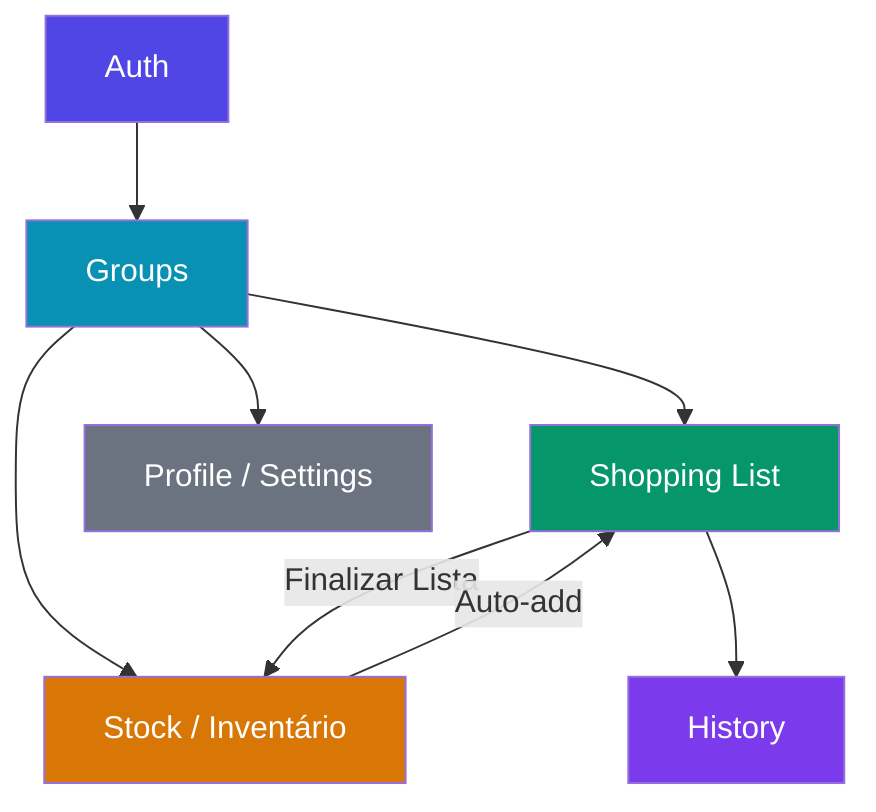
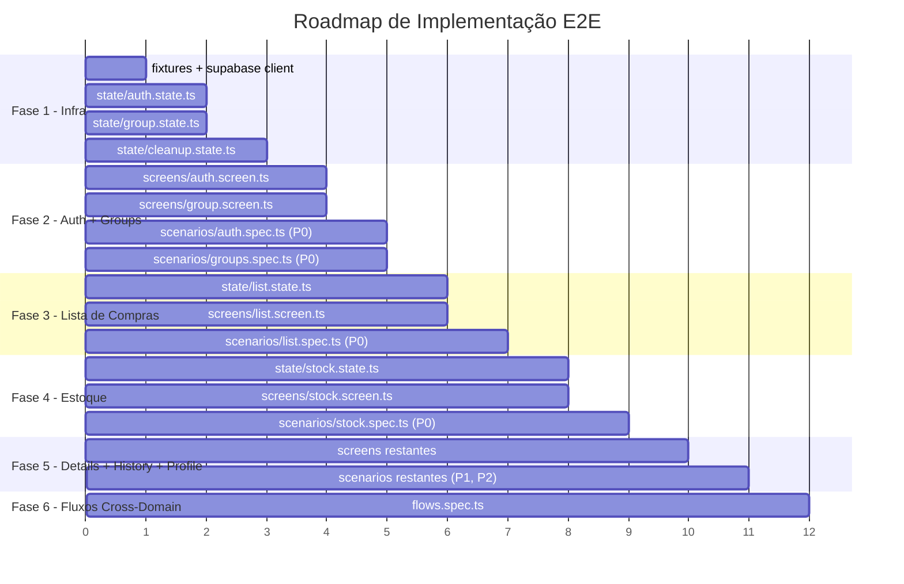

# Mapa E2E Completo — Meu Estoque

> Arquitetura funcional | Playwright + TypeScript | Injeção de estado via Supabase

---

## 1. Mapa de Domínios



| Domínio | Rotas | Tabelas Principais |
|---|---|---|
| **Auth** | `/login`, `/register` | `auth.users`, `profiles` |
| **Groups** | `/group` | `groups`, `group_members` |
| **Shopping List** | `/list` | `shopping_lists`, `items`, `product_catalog` |
| **Stock** | `/stock`, `/stock/item/:id` | `stock_items`, `stock_lots`, `stock_movements` |
| **History** | `/history` | `shopping_lists` (status=closed), `items` |
| **Profile/Settings** | `/profile` | `group_members`, `profiles` |

---

## 2. Inventário de Estado (`state/`)

> [!IMPORTANT]
> Cada função insere dados diretamente no Supabase via service role key (bypassa RLS). Nenhuma destas funções toca na UI.

### Arquivo: `state/auth.state.ts`

| Função | Descrição | Retorno |
|---|---|---|
| `seedTestUser(email, password, name)` | Cria usuário no `auth.users` + `profiles` | `{ userId, email }` |
| `cleanupTestUser(userId)` | Remove cascata: user, profiles, group_members | `void` |
| `getAuthSession(email, password)` | Faz login via API e retorna session token | `{ accessToken, refreshToken }` |

### Arquivo: `state/group.state.ts`

| Função | Descrição | Retorno |
|---|---|---|
| `seedGroup(name)` | Cria grupo com `codigo_convite` | `{ groupId, inviteCode }` |
| `seedUserInGroup(userId, groupId)` | Insere em `group_members` | `{ memberId }` |
| `seedFullContext(email, password, name, groupName)` | Cria user + group + membership + active list | `{ userId, groupId, listId, inviteCode, accessToken }` |
| `cleanupGroup(groupId)` | Deleta grupo (cascade limpa members, lists, items, stock) | `void` |

### Arquivo: `state/list.state.ts`

| Função | Descrição | Retorno |
|---|---|---|
| `seedActiveList(groupId)` | Cria `shopping_lists` com `status=active` | `{ listId }` |
| `seedListWithItems(groupId, items[])` | Cria lista ativa + itens não comprados | `{ listId, itemIds[] }` |
| `seedCheckedListItems(listId, items[])` | Insere itens com `comprado=true` + preço | `{ itemIds[] }` |
| `seedFinalizedList(groupId, items[], purchaseDate)` | Cria lista `status=closed` com itens comprados | `{ listId }` |

### Arquivo: `state/stock.state.ts`

| Função | Descrição | Retorno |
|---|---|---|
| `seedStockWithProducts(groupId, products[])` | Cria `product_catalog` + `stock_items` com quantidades | `{ stockItemIds[] }` |
| `seedStockAtMinimum(groupId, product)` | Cria stock_item onde `quantidade <= quantidade_minima` | `{ stockItemId }` |
| `seedStockWithLots(groupId, product, lots[])` | Cria stock_item + múltiplos `stock_lots` | `{ stockItemId, lotIds[] }` |
| `seedStockWithMovements(groupId, product, movements[])` | Cria stock_item + `stock_movements` | `{ stockItemId }` |
| `seedStockNearExpiry(groupId, product, expiryDate)` | Cria stock_item com `data_validade` próxima | `{ stockItemId }` |
| `cleanupGroupStock(groupId)` | Limpa stock_items, lots, movements do grupo | `void` |

### Arquivo: `state/cleanup.state.ts`

| Função | Descrição |
|---|---|
| `cleanupAll(userId, groupId)` | Limpeza total: stock, lists, items, group, user |
| `resetGroupData(groupId)` | Preserva grupo/membros, limpa lists + stock |

---

## 3. Inventário de Telas (`screens/`)

### `screens/auth.screen.ts`

```text
navigateToLogin(page)
fillLoginForm(page, email, password)
submitLogin(page)
verifyLoginError(page, message)
verifyRedirectedToList(page)
navigateToRegister(page)
fillRegisterForm(page, name, email, password, confirmPassword)
submitRegister(page)
```

### `screens/group.screen.ts`

```text
navigateToGroup(page)
fillCreateGroupName(page, name)
submitCreateGroup(page)
verifyInviteCodeVisible(page, code)
fillJoinGroupCode(page, code)
submitJoinGroup(page)
verifyGroupActive(page, groupName)
clickUseGroup(page, groupName)
clickLeaveGroup(page)
verifyNoActiveGroup(page)
copyInviteCode(page)
```

### `screens/list.screen.ts`

```text
navigateToList(page)
addItemViaSmartInput(page, { name, quantity?, unit?, price?, category? })
verifyItemVisible(page, itemName)
verifyItemNotVisible(page, itemName)
toggleItemChecked(page, itemName)
verifyItemChecked(page, itemName)
verifyItemUnchecked(page, itemName)
removeItem(page, itemName)
updateItemQuantity(page, itemName, newQuantity)
updateItemPrice(page, itemName, price)
updateItemUnitPrice(page, itemName, unitPrice)
updateItemValidityDate(page, itemName, date)
clickGenerateSmartList(page)
clickFinalizeShopping(page)
verifyFinalizeToast(page)
verifyItemCount(page, { checked, unchecked })
openImportModal(page)
fillImportText(page, text)
selectImportSource(page, source)
submitImport(page)
verifyImportPreview(page, expectedCount)
clickViewHistory(page)
```

### `screens/stock.screen.ts`

```text
navigateToStock(page)
verifyProductVisible(page, productName)
verifyProductNotVisible(page, productName)
searchProduct(page, query)
clearSearch(page)
toggleFilter(page, filter: 'low' | 'out')
clearFilters(page)
clickAddProduct(page)
fillProductForm(page, { name, category, unit, quantity, minStock, portionSize? })
submitProductForm(page)
openProductEdit(page, productName)
updateProductField(page, field, value)
removeProduct(page, productName)
incrementQuantity(page, productName)
decrementQuantity(page, productName)
consumeProduct(page, productName, portions?)
addToShoppingList(page, productName)
verifyLowStockBadge(page, productName)
verifyOutOfStockBadge(page, productName)
verifyAutoAddToast(page, productName)
clickBulkUpdateValidity(page)
setBulkValidityDate(page, date)
```

### `screens/stockDetails.screen.ts`

```text
navigateToStockItem(page, itemId)
verifyItemName(page, name)
verifyCurrentStock(page, quantity, unit)
verifyMinimumStock(page, minQuantity)
verifyConsumptionAverage(page, { daily?, weekly?, monthly? })
verifyRunoutDays(page, days)
verifyRunoutNoData(page)
verifyLotVisible(page, { remaining, unit, purchaseDate })
verifyMovementVisible(page, { type, quantity })
clickBackToStock(page)
```

### `screens/history.screen.ts`

```text
navigateToHistory(page)
verifyHistoryListVisible(page, { itemCount?, total? })
verifyEmptyHistory(page)
clickDuplicateList(page, listIndex)
verifyDuplicateToast(page, count)
clickDeleteHistory(page, listIndex)
confirmDeleteDialog(page)
editPurchaseDate(page, listIndex, date)
savePurchaseDate(page, listIndex)
clickAddSingleItem(page, itemName)
verifyAddedToast(page, itemName)
```

### `screens/profile.screen.ts`

```text
navigateToProfile(page)
verifyUserName(page, name)
verifyGroupName(page, groupName)
verifyGroupCode(page, code)
clickCopyCode(page)
clickLogout(page)
verifyRedirectedToLogin(page)
selectTheme(page, theme)
selectFontSize(page, size)
verifyMemberVisible(page, memberName)
clickSwitchGroup(page, groupName)
verifyAppVersion(page)
```

### `screens/navigation.screen.ts`

```text
clickNavList(page)
clickNavStock(page)
clickNavConfig(page)
verifyNavActive(page, tab: 'list' | 'stock' | 'config')
verifyNavBadge(page, tab, count)
```

---

## 4. Checklist de Cenários (`scenarios/`)

> [!TIP]
> **Prioridade**: P0 = crítico (happy path), P1 = importante, P2 = edge case/regressão.
> Cada cenário segue o padrão: **State Seed → UI Action → Assert**.

---

### 4.1 Auth (`scenarios/auth.spec.ts`) — 7 cenários

| # | P | Cenário | State Seed | Screen Actions |
|---|---|---|---|---|
| 1 | P0 | Login com credenciais válidas redireciona para `/list` | `seedFullContext()` | `fillLoginForm` → `submitLogin` → `verifyRedirectedToList` |
| 2 | P0 | Login com senha errada exibe erro | `seedTestUser()` | `fillLoginForm(wrong)` → `verifyLoginError` |
| 3 | P1 | Login com email inexistente exibe erro | nenhum | `fillLoginForm` → `verifyLoginError` |
| 4 | P0 | Registro completo redireciona para `/group` | nenhum | `fillRegisterForm` → `submitRegister` → verificar URL `/group` |
| 5 | P1 | Registro com senhas divergentes exibe erro | nenhum | `fillRegisterForm(mismatch)` → `verifyLoginError` |
| 6 | P1 | Registro com email duplicado exibe erro | `seedTestUser()` | `fillRegisterForm(same email)` → `verifyLoginError` |
| 7 | P0 | Logout limpa sessão e redireciona | `seedFullContext()` | login → `clickLogout` → `verifyRedirectedToLogin` |

- [ ] **AUTH-01** (P0): Login com credenciais válidas redireciona para `/list`
- [ ] **AUTH-02** (P0): Login com senha errada exibe mensagem de erro
- [ ] **AUTH-03** (P1): Login com email inexistente exibe mensagem de erro
- [ ] **AUTH-04** (P0): Registro completo cria conta e redireciona para `/group`
- [ ] **AUTH-05** (P1): Registro com senhas divergentes exibe erro client-side
- [ ] **AUTH-06** (P1): Registro com email já existente exibe erro
- [ ] **AUTH-07** (P0): Logout limpa sessão, stores e redireciona para `/login`

---

### 4.2 Groups (`scenarios/groups.spec.ts`) — 8 cenários

- [ ] **GRP-01** (P0): Criar grupo gera código de convite visível
- [ ] **GRP-02** (P0): Entrar em grupo com código válido redireciona para `/list`
- [ ] **GRP-03** (P1): Entrar com código inválido exibe erro
- [ ] **GRP-04** (P0): Trocar de grupo ativo carrega lista correta
- [ ] **GRP-05** (P1): Sair do grupo limpa contexto e volta para `/group`
- [ ] **GRP-06** (P1): Lista "Meus grupos" exibe todos os grupos do usuário
- [ ] **GRP-07** (P2): Usuário sem grupo é redirecionado para `/group`
- [ ] **GRP-08** (P2): Copiar código de convite funciona (clipboard API)

---

### 4.3 Shopping List (`scenarios/list.spec.ts`) — 14 cenários

- [ ] **LST-01** (P0): Adicionar item via smart input aparece na lista
- [ ] **LST-02** (P0): Marcar item como comprado (toggle checked)
- [ ] **LST-03** (P0): Desmarcar item comprado (toggle unchecked)
- [ ] **LST-04** (P0): Remover item da lista
- [ ] **LST-05** (P1): Alterar quantidade de um item existente
- [ ] **LST-06** (P1): Alterar preço total de um item
- [ ] **LST-07** (P1): Alterar preço unitário (recalcula total)
- [ ] **LST-08** (P1): Definir data de validade em item da lista
- [ ] **LST-09** (P0): Gerar lista inteligente adiciona itens abaixo do mínimo
- [ ] **LST-10** (P1): Lista inteligente não duplica itens já presentes
- [ ] **LST-11** (P0): Finalizar compra fecha lista, cria nova, e move pendentes
- [ ] **LST-12** (P1): Importar texto de recibo adiciona itens detectados
- [ ] **LST-13** (P2): Importar com texto vazio exibe erro
- [ ] **LST-14** (P2): Contador de badge na nav reflete itens pendentes

---

### 4.4 Stock / Inventário (`scenarios/stock.spec.ts`) — 12 cenários

- [ ] **STK-01** (P0): Produtos do estoque são visíveis na página
- [ ] **STK-02** (P0): Buscar produto por nome filtra corretamente
- [ ] **STK-03** (P1): Filtro "low stock" exibe apenas itens abaixo do mínimo
- [ ] **STK-04** (P1): Filtro "out of stock" exibe apenas itens zerados
- [ ] **STK-05** (P0): Incrementar quantidade de produto via quick action
- [ ] **STK-06** (P0): Decrementar quantidade (consumir) via quick action
- [ ] **STK-07** (P0): Adicionar novo produto via formulário
- [ ] **STK-08** (P1): Editar produto existente (nome, categoria, unidade)
- [ ] **STK-09** (P0): Remover produto do estoque
- [ ] **STK-10** (P1): Adicionar produto à lista de compras via estoque
- [ ] **STK-11** (P1): Auto-add: consumir abaixo do mínimo exibe toast
- [ ] **STK-12** (P1): Bulk update de validade em múltiplos itens

---

### 4.5 Stock Details (`scenarios/stock-details.spec.ts`) — 6 cenários

- [ ] **DET-01** (P0): Página exibe nome, quantidade e unidade corretos
- [ ] **DET-02** (P1): Consumo médio (diário, semanal, mensal) é exibido
- [ ] **DET-03** (P1): Projeção de ruptura exibe dias restantes
- [ ] **DET-04** (P2): Projeção exibe "sem dados" quando não há movimentos
- [ ] **DET-05** (P1): Lotes recentes exibem quantidade restante e data
- [ ] **DET-06** (P1): Movimentações recentes exibem tipo e origem

---

### 4.6 History (`scenarios/history.spec.ts`) — 6 cenários

- [ ] **HIS-01** (P0): Listas finalizadas aparecem no histórico
- [ ] **HIS-02** (P0): Duplicar lista copia itens comprados para lista ativa
- [ ] **HIS-03** (P1): Apagar histórico remove lista finalizada
- [ ] **HIS-04** (P1): Editar data da compra e salvar
- [ ] **HIS-05** (P1): Adicionar item individual do histórico à lista ativa
- [ ] **HIS-06** (P2): Histórico vazio exibe estado vazio

---

### 4.7 Profile/Settings (`scenarios/profile.spec.ts`) — 5 cenários

- [ ] **PRF-01** (P0): Página exibe nome do usuário e grupo ativo
- [ ] **PRF-02** (P1): Trocar grupo via perfil navega para `/list`
- [ ] **PRF-03** (P1): Membros do grupo são listados
- [ ] **PRF-04** (P2): Trocar tema persiste preferência
- [ ] **PRF-05** (P2): Versão do app é exibida

---

### 4.8 Fluxos E2E Cross-Domain (`scenarios/flows.spec.ts`) — 3 cenários

> [!NOTE]
> Estes são testes de integração que cruzam múltiplos domínios. Usam state seed mínimo e validam a jornada completa.

- [ ] **FLW-01** (P0): **Jornada completa de compra** — Login → Adicionar itens na lista → Marcar como comprados → Finalizar → Verificar no estoque
- [ ] **FLW-02** (P0): **Ciclo de reposição** — Seed estoque abaixo do mínimo → Gerar lista inteligente → Verificar itens adicionados → Finalizar → Verificar estoque atualizado
- [ ] **FLW-03** (P1): **Multi-grupo** — Criar 2 grupos → Trocar entre eles → Verificar que lista e estoque são isolados

---

## 5. Estrutura Final de Diretórios

```text
tests/e2e/
├── fixtures/
│   └── testData.ts              # Constantes (TEST_EMAIL, TEST_PASSWORD, etc.)
├── state/
│   ├── auth.state.ts            # seedTestUser, cleanupTestUser, getAuthSession
│   ├── group.state.ts           # seedGroup, seedUserInGroup, seedFullContext
│   ├── list.state.ts            # seedActiveList, seedListWithItems, seedFinalizedList
│   ├── stock.state.ts           # seedStockWithProducts, seedStockAtMinimum, etc.
│   └── cleanup.state.ts         # cleanupAll, resetGroupData
├── screens/
│   ├── auth.screen.ts           # login/register actions
│   ├── group.screen.ts          # create/join/switch group actions
│   ├── list.screen.ts           # shopping list CRUD actions
│   ├── stock.screen.ts          # stock CRUD + filters + quick actions
│   ├── stockDetails.screen.ts   # item detail page assertions
│   ├── history.screen.ts        # history actions (duplicate, delete, edit date)
│   ├── profile.screen.ts        # settings + logout actions
│   └── navigation.screen.ts     # bottom nav bar actions + badge assertions
├── flows/                       # (opcional) composições de UI para jornadas longas
│   └── purchase.flow.ts         # add items → check → finalize
└── scenarios/
    ├── auth.spec.ts             # AUTH-01..07
    ├── groups.spec.ts           # GRP-01..08
    ├── list.spec.ts             # LST-01..14
    ├── stock.spec.ts            # STK-01..12
    ├── stock-details.spec.ts    # DET-01..06
    ├── history.spec.ts          # HIS-01..06
    ├── profile.spec.ts          # PRF-01..05
    └── flows.spec.ts            # FLW-01..03
```

---

## 6. Ordem de Implementação Recomendada



| Fase | Entregáveis | Cenários |
|---|---|---|
| **1** | Infra: fixtures, supabase admin client, cleanup | 0 |
| **2** | Auth + Groups (P0) | ~10 |
| **3** | Shopping List (P0 + P1) | ~14 |
| **4** | Stock (P0 + P1) | ~12 |
| **5** | Details + History + Profile | ~17 |
| **6** | Fluxos cross-domain | 3 |
| **Total** | | **~56 cenários** |

---

## 7. Lógica de Decisão

```text
PARA CADA cenário de teste:
  1. O teste precisa de dados prévios no banco?
     SIM → Usar função de state/ correspondente (NUNCA criar via UI)
     NÃO → Iniciar direto na screen/

  2. O teste valida uma funcionalidade de UI específica?
     SIM → Usar screen/ para ação atômica + assert
     NÃO → Provavelmente é um teste de API, não E2E

  3. O cenário cruza mais de 1 domínio?
     SIM → Colocar em flows.spec.ts
     NÃO → Colocar no spec do domínio principal

  4. Cleanup:
     SEMPRE usar afterEach/afterAll com cleanup.state.ts
     NUNCA depender de ordem de execução entre testes
```


 
### Resumo da Análise

Analisei **9 páginas**, **5 stores**, **20 migrations SQL**, **8 componentes de inventory**, e o **RPC de finalização** para produzir:

| Camada | Quantidade |
|---|---|
| **Domínios** mapeados | 6 (Auth, Groups, List, Stock, History, Profile) |
| **Funções de state/** | ~15 seed/cleanup functions |
| **Arquivos de screens/** | 8 arquivos com ~50 ações atômicas |
| **Cenários de teste** | **56 cenários** em 8 spec files |
| **Fluxos cross-domain** | 3 (jornada completa, ciclo reposição, multi-grupo) |

### Decisões-chave

1. **`seedFullContext()`** é a função mais reutilizada — cria user + group + membership + active list de uma vez, cobrindo o bootstrap de ~80% dos testes
2. **Fluxo de finalização** (LST-11 / FLW-01) é o cenário mais crítico — ele cruza `items` → `product_catalog` → `stock_items` → `stock_lots` → `stock_movements` via RPC
3. **Auto-add to list** (STK-11) requer seed de stock no mínimo e validação de toast — é um fluxo reativo que depende do debounce de 700ms do store

Revise o documento e me diga se quer que eu ajuste prioridades, adicione cenários, ou comece a implementar alguma fase.

The artifact was approved. Let me start implementing **Fase 1 — Infraestrutura** of the E2E test architecture. First, let me check what already exists for tests and Playwright config.

Listed directory meuestoque
Searched for "playwright"
Viewed supabase.ts:1-17
Viewed playwright.config.ts:1-45
Listed directory e2e
Viewed .env.example:1-19
Viewed package.json:1-75

Let me check the existing E2E tests to understand the current patterns:

Listed directory general
Viewed .env.local:1-11
Viewed auth-and-core-flow.spec.ts:1-115

Now I have full context. Let me check the existing tsconfig for E2E path compatibility and the RLS helper function:

Viewed tsconfig.node.json:1-27
Searched for "is_group_member"

I have all the context needed. Now let me implement Fase 1 — the infrastructure files. I'll create the Supabase admin client, fixtures, and the core state files.

Created supabaseAdmin.ts
Created testData.ts

Now let me create the state layer files:

Created auth.state.ts
Created group.state.ts
Created list.state.ts
Created stock.state.ts
Created cleanup.state.ts

Now let me update the `.env.example` with the new required variable and add the `E2E_SUPABASE_SERVICE_ROLE_KEY` placeholder:

Edited .env.example

Now let me update the `playwright.config.ts` to load `.env.local` so the new state layer can access environment variables:

Edited playwright.config.ts

Now let me also update the `tsconfig.node.json` to include the new E2E config/state files:

Edited tsconfig.node.json

Let me verify the final file structure was created correctly:

Listed directory e2e
Ran command: `cd /home/gabs/projects/meuestoque && npx tsc --noEmit --project tsconfig.node.json 2>&1 | head -40`

TypeScript compilation passed with zero errors. Let me verify the full tree:

Ran command: `find /home/gabs/projects/meuestoque/e2e/{config,fixtures,state} -type f -name "*.ts" | sort`

All 7 files created and type-checked. Here's a summary of **Fase 1 — Infraestrutura** delivered:

### Arquivos Criados

| Arquivo | Propósito |
|---|---|
| `e2e/config/supabaseAdmin.ts` | Client admin com `service_role` key (bypassa RLS) |
| `e2e/fixtures/testData.ts` | Geradores de IDs únicos, templates de produtos/itens |
| `e2e/state/auth.state.ts` | `seedTestUser`, `cleanupTestUser`, `getAuthSession` |
| `e2e/state/group.state.ts` | `seedGroup`, `seedUserInGroup`, `seedFullContext` |
| `e2e/state/list.state.ts` | `seedActiveList`, `seedListWithItems`, `seedFinalizedList` |
| `e2e/state/stock.state.ts` | `seedStockWithProducts`, `seedStockAtMinimum`, `seedStockWithLots`, etc. |
| `e2e/state/cleanup.state.ts` | `cleanupAll`, `resetGroupData` |

### Alterações em Existentes

| Arquivo | Mudança |
|---|---|
| `playwright.config.ts` | Adicionado `import "dotenv/config"` |
| `tsconfig.node.json` | Expandido `include` para `e2e/**/*.ts` |
| `.env.example` | Adicionado `E2E_SUPABASE_SERVICE_ROLE_KEY` e `E2E_SUPABASE_URL` |

### Próximo Passo

Para usar o `seedFullContext()` e o restante, você precisa adicionar a `E2E_SUPABASE_SERVICE_ROLE_KEY` ao seu `.env.local`. Ela pode ser encontrada no painel do Supabase em **Settings → API → service_role key**.

Quer que eu prossiga para a **Fase 2** (screens de Auth/Groups + primeiros specs AUTH-01..07 e GRP-01..08)?
