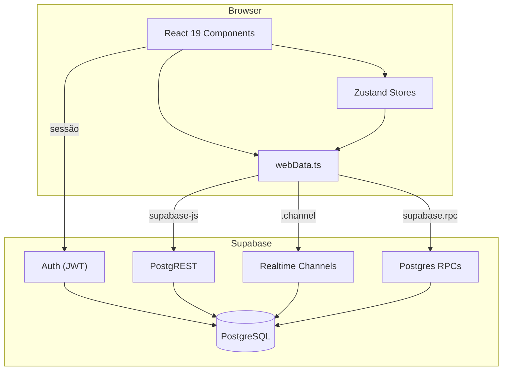

# Diagrama de Stack

Visão runtime do Meu Estoque (web).

## Camadas

| Camada | Pasta | Responsabilidade |
|---|---|---|
| Apresentação | `src/components`, `src/features/*/components` | UI puro, daisyUI + Tailwind. |
| Páginas | `src/pages` | Orquestração entre stores e features. |
| Estado global | `src/stores` | Zustand. |
| Acesso a dados | `src/lib/webData.ts` | Wrapper sobre `supabase-js`. |
| Domínio | `src/domain` | Regras puras. |
| Banco | `supabase/migrations` | Schema, RLS, RPCs. |

## Fluxo típico (finalizar compra)

1. UI dispara handler em `ListPageNew`.
2. `webData.finishShoppingList()` invoca `rpc_finalize_shopping_list`.
3. RPC roda transação atômica (lê `items`, escreve `stock_items`, `stock_lots`, `stock_movements`).
4. Realtime Channel notifica clientes assinando `items`.
5. Zustand re-renderiza UI.

Detalhes em [`docs/ai/04_RPC_CONTRACTS.md`](./ai/04_RPC_CONTRACTS.md) e [`docs/ai/05_DATABASE_MAP.md`](./ai/05_DATABASE_MAP.md).
