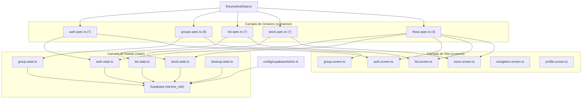

# Arquitetura de Testes E2E — State Injection

> Documentacao da suite de testes E2E funcional do "Meu Estoque", baseada em Playwright + TypeScript com injecao de estado via Supabase Admin API.

## Visao Geral

A arquitetura segue 3 camadas desacopladas: **State** (seed de dados direto no banco), **Screens** (acoes atomicas de UI) e **Scenarios** (composicao de testes declarativos).



## Estrutura de Diretorio

```
e2e/
├── config/
│   └── supabaseAdmin.ts       # Cliente Supabase com service_role key (bypassa RLS)
├── fixtures/
│   └── testData.ts            # Geradores de emails, nomes, templates de produto
├── state/                     # Seed/cleanup direto no banco (sem UI)
│   ├── auth.state.ts          # seedTestUser, cleanupTestUser
│   ├── group.state.ts         # seedFullContext, seedGroup, seedUserInGroup
│   ├── list.state.ts          # seedListWithItems, seedFinalizedList
│   ├── stock.state.ts         # seedStockWithProducts, seedStockAtMinimum
│   └── cleanup.state.ts       # cleanupAll, resetGroupData
├── screens/                   # Acoes atomicas de UI (funcoes puras)
│   ├── auth.screen.ts         # performLogin, fillLoginForm, verifyLoginError, etc.
│   ├── group.screen.ts        # fillCreateGroupName, submitJoinGroup, etc.
│   ├── list.screen.ts         # addItemViaSmartInput, toggleItemChecked, etc.
│   ├── stock.screen.ts        # fillProductForm, searchProduct, consumeProduct, etc.
│   ├── navigation.screen.ts   # clickNavList, clickNavStock, verifyNavBadge
│   └── profile.screen.ts      # clickLogout, verifyRedirectedToLogin
└── scenarios/                 # Specs de teste (composicao declarativa)
    ├── auth.spec.ts           # AUTH-01..07 (7 testes)
    ├── groups.spec.ts         # GRP-01..08 (8 testes)
    ├── list.spec.ts           # LST-01..14 selecao (7 testes)
    ├── stock.spec.ts          # STK-01..10 selecao (7 testes)
    └── flows.spec.ts          # FLW-01..03 (3 testes)
```

## Pre-Requisitos

### Variaveis de Ambiente

Adicione ao `.env.local` (nunca commitar valores reais):

```bash
# URL do Supabase (fallback para VITE_SUPABASE_URL se nao definida)
E2E_SUPABASE_URL=https://seu-projeto.supabase.co

# Service role key (Settings > API > service_role no painel Supabase)
# ATENCAO: Esta chave IGNORA todas as politicas RLS!
E2E_SUPABASE_SERVICE_ROLE_KEY=eyJhbGciOiJIUzI1NiIsInR5cCI6IkpXVCJ9...
```

> A `service_role` key e diferente da `anon` key. Ela tem acesso admin total e so deve ser usada em ambiente de teste local.

### Instalacao do Playwright

```bash
npm run e2e:install
```

## Scripts Disponiveis

| Script | Comando | Descricao |
|---|---|---|
| `e2e:auth` | `npm run e2e:auth` | Roda cenarios de autenticacao (7 testes) |
| `e2e:groups` | `npm run e2e:groups` | Roda cenarios de grupos (8 testes) |
| `e2e:list` | `npm run e2e:list` | Roda cenarios de lista de compras (7 testes) |
| `e2e:stock` | `npm run e2e:stock` | Roda cenarios de estoque (7 testes) |
| `e2e:flows` | `npm run e2e:flows` | Roda fluxos cross-domain (3 testes) |
| `e2e:all` | `npm run e2e:all` | Roda **todos os 32 testes** |

Scripts legados (testes remotos/tablet) permanecem disponiveis com prefixo `e2e:remote:*`.

## Inventario de Cenarios

### AUTH - Autenticacao (P0/P1)

| ID | Prioridade | Cenario |
|---|---|---|
| AUTH-01 | P0 | Login valido redireciona para /list |
| AUTH-02 | P0 | Senha incorreta exibe erro |
| AUTH-03 | P1 | Email inexistente exibe erro |
| AUTH-04 | P0 | Registro cria conta e vai para /group |
| AUTH-05 | P1 | Senhas divergentes exibe erro client-side |
| AUTH-06 | P1 | Email duplicado no registro exibe erro |
| AUTH-07 | P0 | Logout limpa sessao e redireciona |

### GRP - Gestao de Grupos (P0/P1/P2)

| ID | Prioridade | Cenario |
|---|---|---|
| GRP-01 | P0 | Criar grupo gera codigo de convite |
| GRP-02 | P0 | Entrar com codigo valido redireciona para /list |
| GRP-03 | P1 | Codigo invalido exibe erro |
| GRP-04 | P0 | Trocar grupo ativo carrega lista correta |
| GRP-05 | P1 | Sair do grupo limpa contexto |
| GRP-06 | P1 | Listar todos os grupos do usuario |
| GRP-07 | P2 | Usuario sem grupo e redirecionado para /group |
| GRP-08 | P2 | Botao copiar codigo funciona |

### LST - Lista de Compras (P0/P2)

| ID | Prioridade | Cenario |
|---|---|---|
| LST-01 | P0 | Adicionar item via smart input |
| LST-02 | P0 | Marcar item como comprado |
| LST-03 | P0 | Desmarcar item comprado |
| LST-04 | P0 | Remover item da lista |
| LST-09 | P0 | Lista inteligente adiciona itens baixos |
| LST-11 | P0 | Finalizar compra fecha lista |
| LST-14 | P2 | Contagem de pendentes e comprados |

### STK - Estoque (P0/P1)

| ID | Prioridade | Cenario |
|---|---|---|
| STK-01 | P0 | Produtos do estoque sao visiveis |
| STK-02 | P0 | Buscar produto por nome |
| STK-03 | P1 | Filtro "baixo" exibe itens abaixo do minimo |
| STK-04 | P1 | Filtro "zerado" exibe itens sem estoque |
| STK-07 | P0 | Adicionar produto via formulario |
| STK-09 | P0 | Remover produto do estoque |
| STK-10 | P1 | Adicionar produto a lista via estoque |

### FLW - Fluxos Cross-Domain (P0/P1)

| ID | Prioridade | Cenario |
|---|---|---|
| FLW-01 | P0 | Jornada completa: lista > comprar > finalizar > estoque |
| FLW-02 | P0 | Ciclo de reposicao com lista inteligente |
| FLW-03 | P1 | Isolamento de estoque entre grupos |

## Principios de Design

### 1. State Injection (Nunca UI para Setup)

```typescript
// CORRETO: Seed via admin API
test.beforeAll(async () => {
  const ctx = await seedFullContext(email, password, "User", groupName);
  userId = ctx.userId;
  groupId = ctx.groupId;
});

// INCORRETO: Criar usuario via formulario UI
test.beforeAll(async ({ page }) => {
  await page.goto("/register");
  await page.fill("#email", email);
  // ... lento, fragil, nao-determinístico
});
```

### 2. Screens como Funcoes Puras

Cada funcao em `screens/` faz exatamente uma acao:

```typescript
// Uma acao atomica
export const fillLoginForm = async (page: Page, email: string, password: string): Promise<void> => {
  const form = page.locator("form").first();
  await form.locator('input[type="email"]').first().fill(email);
  await form.locator('input[type="password"]').first().fill(password);
};

// Composicao no cenario
test("deve autenticar", async ({ page }) => {
  await AuthScreen.navigateToLogin(page);
  await AuthScreen.fillLoginForm(page, email, password);
  await AuthScreen.submitLogin(page);
  await AuthScreen.verifyRedirectedToList(page);
});
```

### 3. Isolamento Total por Teste

- Cada `test.describe` cria seu proprio usuario + grupo
- `test.afterAll` executa `cleanupAll` para remover todos os dados
- Testes de lista/estoque usam `resetGroupData` no `beforeEach`

### 4. Nomenclatura Deterministica

```typescript
// Emails unicos por cenario
export const testEmail = (scenario: string): string =>
  `e2e-${scenario}-${Date.now()}@test.local`;

// Nomes de grupo unicos
export const testGroupName = (): string =>
  `E2E Group ${Date.now()}`;
```

## Troubleshooting

| Problema | Causa | Solucao |
|---|---|---|
| `Missing E2E_SUPABASE_URL` | `.env.local` nao carregado | Verificar se `playwright.config.ts` importa `dotenv` com `path: ".env.local"` |
| `Missing service_role key` | Key nao configurada | Copiar de Settings > API no painel Supabase |
| `No tests found` | Erro no bootstrap impede descoberta | Resolver erro de env vars primeiro |
| Timeout em `verifyRedirectedToList` | Sessao nao restaurada | Verificar se `seedFullContext` cria lista ativa |
| `RLS violation` em seed | Usando `supabaseAnon` | Usar `supabaseAdmin` (service_role) |
