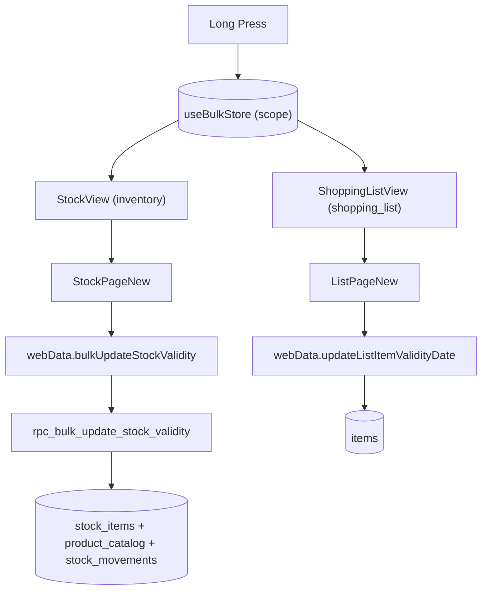

# Feature: Bulk Expiration Management

## Objetivo

Gerenciar a validade de múltiplos itens em uma única ação, na Lista de Compras e no Estoque, com proteções contra erros lógicos e aprendizado automático no catálogo.

## Arquitetura

## Modelo de dados

| Tabela | Colunas |
|---|---|
| `product_catalog` | `perecivel`, `validade_padrao_dias` |
| `stock_items` | `data_validade`, `data_validade_alerta`, `validade_nao_aplica` |
| `items` | `data_validade`, `nao_aplica_validade` |
| `stock_movements` | `tipo='ajuste_validade_bulk'`, `quantidade=0` |

## Fluxos

### A. Bulk no Estoque

1. Long press em `ProductCard` ativa Bulk Mode (scope `inventory`).
2. Header substituído por contador + cancelar.
3. Action bar fixa: **Definir Validade** | **Não se aplica**.
4. Conflito: warning com radio `only_missing` (default) vs `overwrite_all`.
5. Categorias incompatíveis: bloqueia Não se aplica + tooltip.
6. Smart suggestion: >=80% Limpeza injeta badge Recomendado.
7. Persistência: `rpc_bulk_update_stock_validity`.

### B. Bulk na Lista de Compras

Mesmo modelo, scope `shopping_list`. Usa `updateListItemValidityDate` em loop. `rpc_finalize_shopping_list` materializa em `stock_items` no checkout.

### C. Catalog Learning

- Não se aplica em massa: `product_catalog.perecivel = false`.
- Validade na finalização: grava `validade_padrao_dias = (data_validade - data_compra)`.

### D. Undo

No `ProductFormModal`, quando `naoAplicaValidade = true`, botão Tratar como perecível chama `setStockItemPerishable()` que reseta ambos os níveis.

## Regras de aceite

- [x] Long press abre Bulk Mode.
- [x] Action bar com Definir Validade e Não se aplica.
- [x] Conflito de datas com radio.
- [x] Categorias incompatíveis bloqueiam Não se aplica.
- [x] >=80% Limpeza injeta Recomendado.
- [x] RPC valida membership.
- [x] Movimento bulk é informativo (qty=0).
- [x] Undo no ProductFormModal.
- [x] Itens não comprados perdem `data_validade` ao migrar.

## Referências

- Migrations: `supabase/migrations/20260501_bulk_expiration_feature.sql`, `20260501110000_rpc_bulk_validity.sql`.
- Store: `src/stores/bulkStore.ts` + testes em `src/stores/__tests__/bulkStore.test.ts`.
- Componentes: `src/features/inventory/components/{stockView,shoppingListView,productCard,shoppingListItem,productFormModal}`.
- ADR: [`docs/adr/0001-validade-nao-aplica.md`](../adr/0001-validade-nao-aplica.md).
