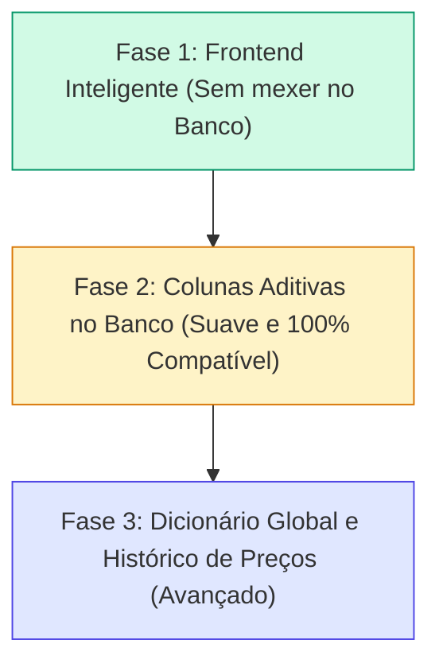

# Análise de Banco de Dados e Plano de Ação: Dicionário de Produtos e Marcas

> **Data:** 13/09/2026  
> **Status:** Proposta de Arquitetura e Plano de Ação  
> **Contexto:** Comparação inteligente de marcas (Mesma Marca vs Outra Marca Mais Barata) na cotação Tenda e estruturação de catálogo.

---

## 1. Diagnóstico do Banco de Dados Atual (Supabase)

### 1.1 Como os dados são armazenados hoje

Atualmente, o fluxo de compras e catálogo utiliza principalmente três tabelas:

1. **`public.items` (Itens da Lista de Compras):**
   - `id` (uuid)
   - `list_id` (uuid $\rightarrow$ `shopping_lists`)
   - `product_id` (uuid nullable $\rightarrow$ `product_catalog`)
   - `nome` (text livre, ex: `"Feijão Preto Camil Tipo 1 1kg"`)
   - `quantidade` / `quantidade_num` / `unidade`
   - `preco` / `preco_unitario` / `preco_total`
   - `pack_label` / `pack_size` / `pack_unit`

2. **`public.product_catalog` (Catálogo de Produtos):**
   - `id` (uuid)
   - `group_id` (uuid $\rightarrow$ `groups`)
   - `nome` (text livre, ex: `"Feijão Preto Camil"`)
   - `categoria` (text)
   - `unidade_estoque` / `unidade_tipo`
   - `ean` (text, código de barras)

3. **`public.stock_items` & `public.stock_lots` (Estoque e Lotes):**
   - `nome` (text livre herdado do catálogo ou digitado)
   - `product_id` (uuid nullable)
   - Custos unitários e históricos de lote por compra.

---

### 1.2 Pontos de Atenção e Lacunas Identificadas

| Ponto | Situação Atual | Impacto |
| :--- | :--- | :--- |
| **Marca misturada no Nome** | Não existe coluna `marca` ou `brand`. Tudo fica concatenado na string `nome` (ex: `"Feijão Preto Camil 1kg"`). | O sistema precisa adivinhar por regex o que é marca, o que é tipo e o que é alimento. |
| **Falta de "Produto Base / Canônico"** | Não existe distinção entre a *categoria essencial* (ex: `"Feijão Preto"`) e o *item específico* (ex: `"Feijão Preto Camil"`). | Dificulta cotar "qualquer feijão preto" quando o usuário cadastrou "Feijão Preto Camil". |
| **Catálogo Isolado por Grupo** | `product_catalog` possui `group_id` obrigatório. | Se um usuário cadastra a marca "Camil" e seu produto base no Grupo A, o Grupo B não se beneficia desse aprendizado. |
| **Vínculo Opcional de Catálogo** | Em `items`, `product_id` é nullable. | Muitos itens da lista de compras são textos soltos digitados sem vínculo com o catálogo formal. |
| **Cotações Efêmeras** | As cotações do Tenda ficam apenas no `localStorage` e expiram à meia-noite. | Não há histórico de preços no banco para saber se um produto subiu ou desceu de preço com o passar dos meses. |

---

## 2. Plano de Ação em Fases

Para não interromper o fluxo atual nem criar migrations complexas de uma só vez, a evolução pode ser dividida em **3 fases modulares**:



---

### Fase 1 — Frontend Inteligente (Recomendado de Imediato / Sem mexer no banco)
*Objetivo: Entregar a experiência de comparar marcas imediatamente sem risco de migração de banco.*

1. **Parser de Produto Base vs Marca (`src/services/productParser.ts`):**
   - Cria lista base de marcas populares do varejo brasileiro (`KNOWN_BRANDS`: Camil, Namorado, Kicaldo, Tio João, Pilão, Melitta, 3 Corações, União, Nestlé, Italac, Piracanjuba, Select, etc.).
   - Função `parseProductItemName(rawName)` que decompõe:
     - `"Feijão Preto Camil 1kg"` $\rightarrow$ `{ baseProduct: "Feijão Preto", brand: "Camil", size: "1kg" }`
     - `"Arroz Namorado 5kg"` $\rightarrow$ `{ baseProduct: "Arroz", brand: "Namorado", size: "5kg" }`
     - `"Feijão Preto 1kg"` $\rightarrow$ `{ baseProduct: "Feijão Preto", brand: null, size: "1kg" }`
2. **Busca Abrangente no Tenda:**
   - Se o item tem marca, a busca no Tenda é disparada pelo **produto base** (`"feijao preto"`).
   - Traz todas as marcas disponíveis na loja.
3. **Comparador de Marcas no Drawer (`TendaPriceDrawer`):**
   - Se o usuário pediu **Camil**:
     - Mostra a oferta da **Mesma Marca**: Feijão Preto Camil 1kg por R$ 8,50.
     - Se existir outra marca mais barata (ex: Namorado por R$ 6,90), exibe um card destacado:
       *💡 Outra marca mais barata: **Feijão Preto Namorado 1kg** por **R$ 6,90** (Economia de R$ 1,60)*.
     - Botão com 1 clique para escolher qual preço usar.
4. **Auto-aprendizado de Marcas:**
   - As respostas da API do Tenda trazem o campo `brand` de cada produto. Esse conjunto de marcas é incorporado ao cache local do navegador, expandindo o dicionário automaticamente a cada cotação.

---

### Fase 2 — Colunas Aditivas no Banco (Evolução Suave / Próximo Sprint)
*Objetivo: Estruturar os dados no Supabase sem quebrar nenhuma tabela existente.*

Criar uma migration simples adicionando colunas opcionais (nullable):

```sql
-- Migration: 20260601_01_add_brand_and_canonical_to_items_and_catalog.sql
ALTER TABLE public.items
  ADD COLUMN IF NOT EXISTS marca text,
  ADD COLUMN IF NOT EXISTS produto_base text;

ALTER TABLE public.product_catalog
  ADD COLUMN IF NOT EXISTS marca text,
  ADD COLUMN IF NOT EXISTS produto_base text;

COMMENT ON COLUMN public.items.marca IS 'Marca do produto (ex: Camil, Namorado, Pilão)';
COMMENT ON COLUMN public.items.produto_base IS 'Nome canônico/base do produto (ex: Feijão Preto, Arroz Branco, Café)';
```

**Vantagens:**
- 100% retrocompatível: nenhum código atual quebra.
- Ao salvar um item na lista de compras ou no catálogo, o app salva a marca e o produto base separadamente.
- Permite filtros avançados no futuro (ex: "Ver todos os feijões pretos independente da marca", "Relatório de gastos por marca").

---

### Fase 3 — Dicionário Global e Histórico de Preços (Avançado / Futuro)
*Objetivo: Inteligência coletiva entre grupos e monitoramento de inflação/preços.*

1. **Tabelas Globais de Referência:**
   - `public.global_brands`: marcas homologadas e seus aliases.
   - `public.global_base_products`: produtos padronizados (com unidade sugerida e categoria padrão).
2. **Histórico de Preços de Supermercado:**
   - `public.store_price_history`:
     - Armazena `(store, base_product, brand, price, date)`.
     - Alimenta gráficos de histórico de preço: *"O café Pilão 500g aumentou 12% este mês"* ou *"A marca Namorado é consistentemente 18% mais barata que a Camil neste CEP"*.

---

---

## 3. Descoberta na API do Tenda Atacado: Começando com 2.414 Marcas

Investigamos os endpoints públicos da API do Tenda e encontramos recursos que eliminam a necessidade de cadastrar marcas manualmente do zero:

1. **Endpoint Direto de Marcas (`GET /api/public/store/brands`):**
   * Retorna **2.414 marcas reais** do varejo brasileiro já cadastradas com ID, Nome e Link:
     * Exemplos encontrados: *Camil, Namorado, Kicaldo, Tio João, Pilão, Melitta, 3 Corações, União, Nestlé, Omo, Ypê, Dona Benta, Bauducco, Qualitá, Select, Da Casa*, etc.
2. **Endpoint de Departamentos e Categorias (`GET /api/public/store/departments`):**
   * Retorna a árvore hierárquica completa de categorias do supermercado (Mercearia, Hortifruti, Carnes, Limpeza, etc.).
3. **Metadados em cada Produto da Busca (`/api/public/store/search`):**
   * Cada produto retornado já inclui:
     * `brand`: Marca oficial.
     * `barcode`: Código de barras EAN (integrável com nosso scanner de código de barras).
     * `department`: Categoria / Departamento.

---

## 4. Modelagem da Tabela de Dicionário no Supabase (`brand_dictionary`)

Em vez de manter o dicionário apenas em código, podemos ter uma tabela leve no Supabase que já nasce populada com as marcas do Tenda e vai sendo incrementada ao longo do tempo:

```sql
create table if not exists public.brand_dictionary (
  id uuid primary key default gen_random_uuid(),
  nome text not null unique,
  nome_normalizado text not null unique,
  origem text not null default 'tenda',
  ativo boolean not null default true,
  created_at timestamptz not null default now()
);

create index if not exists ix_brand_dictionary_normalizado
  on public.brand_dictionary (nome_normalizado);
```

### Como ela é incrementada ao longo do tempo:
1. **Seed Inicial:** Importação das marcas do Tenda (`/api/public/store/brands`).
2. **Incremento Automático na Cotação:** Ao realizar buscas no Tenda, qualquer nova marca encontrada na resposta (`product.brand`) é inserida com:
   `INSERT INTO brand_dictionary (nome, nome_normalizado, origem) VALUES (...) ON CONFLICT (nome_normalizado) DO NOTHING;`
3. **Sem esforço manual:** O banco aprende marcas novas de forma 100% autônoma conforme o app é utilizado pelos membros do grupo.

---

## 5. Resumo da Recomendação

1. **Seed / Tabela de Marcas**: Criar a tabela `brand_dictionary` via migration simples e popular com o retorno do endpoint do Tenda.
2. **Frontend Inteligente**: Usar o dicionário para separar Produto Base vs Marca e habilitar a comparação (*Camil R$ 8,50 vs Namorado R$ 6,90*).

