# Mapa do Banco de Dados — Meu Estoque

> [!NOTE]
> Mapa gerado em 25/04/2026 com base no schema atual do Supabase.
> Atualizado para refletir o design correto do `stock_lots`: controle de lotes por data de validade (FIFO).

## Diagrama ER

```mermaid
erDiagram
    %% ─── USUÁRIOS / GRUPOS ───────────────────────────────────────

    auth_users {
        uuid id PK
    }

    profiles {
        uuid id PK "FK → auth.users"
        text nome
        timestamptz created_at
    }

    groups {
        uuid id PK
        text nome
        text codigo_convite UK
        timestamptz criado_em
    }

    group_members {
        uuid id PK
        uuid group_id FK
        uuid user_id FK
        timestamptz entrou_em
    }

    %% ─── LISTA DE COMPRAS ────────────────────────────────────────

    shopping_lists {
        uuid id PK
        uuid group_id FK
        boolean ativa
        text status "active | closed | archived"
        uuid fechado_por FK
        date closed_purchase_date
        numeric total
        timestamptz criada_em
        timestamptz finalizada_em
        timestamptz finalized_at
    }

    items {
        uuid id PK
        uuid list_id FK
        uuid product_id FK "🔴 não usado na prática"
        text nome
        text quantidade "texto livre ex: '2 kg'"
        text quantidade_raw
        numeric quantidade_num "🟡 parseado de quantidade"
        text unidade "🟡 parseado de quantidade"
        text categoria
        boolean comprado
        numeric preco "💰 campo atual usado"
        numeric preco_unitario "🔴 existe mas nunca preenchido"
        numeric preco_total "🔴 existe mas nunca preenchido"
        timestamptz comprado_em
        uuid criado_por FK
        date data_validade
        boolean nao_aplica_validade
        timestamptz criado_em
        timestamptz atualizado_em
    }

    %% ─── CATÁLOGO DE PRODUTOS ────────────────────────────────────

    product_catalog {
        uuid id PK
        uuid group_id FK
        text nome
        text categoria
        text unidade_estoque "ex: Kg, L, Un"
        text unidade_tipo "simple | composite"
        numeric porcao_padrao
        text unidade_porcao
        text[] consumo_tags
        boolean perecivel
        boolean ativo
        timestamptz created_at
        timestamptz updated_at
    }

    product_unit_conversion {
        uuid product_id PK "FK → product_catalog"
        numeric compra_quantidade "ex: 1"
        text compra_unidade "ex: saco"
        numeric rendimento_quantidade "ex: 5"
        text rendimento_unidade "ex: Kg"
        numeric fator_consumo_padrao
        timestamptz created_at
        timestamptz updated_at
    }

    %% ─── ESTOQUE ─────────────────────────────────────────────────

    stock_items {
        uuid id PK
        uuid group_id FK
        uuid product_id FK "🔴 não usado na prática"
        text nome
        text categoria
        text unidade "unidade base de estoque"
        numeric quantidade "🟡 deveria = SUM(lots.restante)"
        numeric quantidade_atual "🔴 duplicado de quantidade"
        numeric quantidade_minima
        numeric tamanho_porcao
        boolean na_lista
        boolean auto_adicionar_lista
        text consumo_frequencia "daily | weekly | monthly"
        numeric consumo_valor
        date data_compra
        date data_validade "🔴 deveria vir do lote mais próximo"
        date data_validade_alerta "✅ Atualizado no fechamento/bulk mode"
        boolean validade_nao_aplica "✅ Para itens não perecíveis"
        timestamptz ultimo_consumo_auto_em
        timestamptz criado_em
        timestamptz atualizado_em
        timestamptz updated_at "🔴 duplicado de atualizado_em"
    }

    stock_lots {
        uuid id PK
        uuid stock_item_id FK
        uuid source_list_item_id FK "rastreabilidade item → lote"
        uuid created_by FK
        text unidade
        numeric quantidade_inicial "qty na entrada do lote"
        numeric quantidade_restante "qty ainda disponível"
        numeric custo_total "💰 custo total do lote"
        numeric custo_unitario "💰 R$ por unidade no lote"
        numeric fator_consumo
        date data_compra
        date data_validade "validade deste lote"
        timestamptz created_at
    }

    stock_movements {
        uuid id PK
        uuid item_id FK "🔴 legado → stock_items"
        uuid stock_item_id FK "→ stock_items (atual)"
        uuid lot_id FK "lote afetado"
        uuid source_list_id FK
        uuid source_list_item_id FK
        uuid criado_por FK
        text tipo "entrada | saida | ajuste | consumo_auto | ajuste_validade_bulk"
        text origem "list_finalize | quick_consume | import | adjustment"
        numeric quantidade
        text unidade
        numeric custo_unitario_ref "🔴 nunca preenchido"
        text observacao
        timestamptz criado_em
    }

    rate_limits {
        bigint id PK
        uuid user_id FK
        text action
        timestamptz created_at
    }

    %% ─── RELAÇÕES ────────────────────────────────────────────────

    auth_users ||--|| profiles : "tem perfil"
    auth_users ||--o{ group_members : "participa de"
    auth_users ||--o{ rate_limits : "tem limites"

    groups ||--o{ group_members : "tem membros"
    groups ||--o{ shopping_lists : "tem listas"
    groups ||--o{ stock_items : "tem estoque"
    groups ||--o{ product_catalog : "tem catálogo"

    profiles ||--o{ shopping_lists : "fechou"
    profiles ||--o{ stock_lots : "criou lote"

    shopping_lists ||--o{ items : "contém"
    shopping_lists ||--o{ stock_movements : "gerou movimentações"

    items }o--|| product_catalog : "referencia produto (🔴 não usado)"
    items ||--o{ stock_lots : "originou lote (🟡 parcial via RPC)"
    items ||--o{ stock_movements : "originou movimentação (🟡 parcial)"

    product_catalog ||--o| product_unit_conversion : "tem conversão (🔴 vazio)"
    product_catalog ||--o{ stock_items : "referencia item (🔴 não usado)"

    stock_items ||--o{ stock_lots : "tem lotes de validade"
    stock_items ||--o{ stock_movements : "tem movimentações"

    stock_lots ||--o{ stock_movements : "movimentações do lote"
```



---

## Legenda

| Ícone | Significado |
|---|---|
| ✅ | Existe e está sendo usado corretamente |
| 🟡 | Existe e é parcialmente usado |
| 🔴 | Existe mas **não implementado** na prática |
| 💰 | Campo de preço/custo |

---

## O Que é Cada Tabela (Design Original)

### `stock_items` → O **produto** na despensa
Representa um tipo de produto que você mantém em casa (ex: Arroz, Leite, Carne moída).
Define a unidade base, mínimo, consumo automático etc.

### `stock_lots` → Os **lotes físicos** daquele produto
> ⚠️ Interpretação correta: perdida durante refatorações.

Cada compra de um produto cria um ou mais lotes, cada um com sua **data de validade** e **custo**. Isso permite:
- Exibir "Leite: 2 lotes — vence 05/05 (1L) e 10/05 (2L)"
- Alertar sobre itens próximos de vencer
- Consumir pelo lote mais antigo primeiro (**FIFO**)
- Rastrear custo histórico por lote (preco pago em cada compra)

```
stock_items: "Leite" (unidade: L, qty: 3)
  └── stock_lots:
        ├── lote A: 1L, vence 05/05, comprado em 20/04, R$5.20/L
        └── lote B: 2L, vence 10/05, comprado em 20/04, R$5.20/L
```

### `stock_movements` → O **ledger** de entradas e saídas
Toda mudança de quantidade (entrada da lista, consumo manual, auto-consumo) gera uma linha aqui. É o histórico auditável de movimentações.

---

## Análise por Tabela

### `items` — Lista de compras
| Campo | Status | Observação |
|---|---|---|
| `quantidade` | ✅ | texto livre ("2 kg", "1 saco") |
| `quantidade_raw` | ✅ | cópia do texto original |
| `quantidade_num` | 🟡 | parseado, mas não guia a lógica de estoque |
| `unidade` | 🟡 | parseado, mas não guia a lógica de estoque |
| `preco` | ✅ | único campo de preço efetivamente usado |
| `preco_unitario` | 🔴 | **existe, nunca preenchido** — R$/Kg ou R$/embalagem |
| `preco_total` | 🔴 | **existe, nunca preenchido** — `quantidade_num × preco_unitario` |
| `product_id` | 🔴 | FK existe, nunca vinculada na UI |
| `data_validade` | ✅ | Preenchido via UI antes da finalização |
| `nao_aplica_validade` | ✅ | Preenchido via UI para itens não perecíveis |

### `product_unit_conversion` — Conversão de unidades
| Status | Observação |
|---|---|
| 🔴 | **Tabela criada, 0 registros** — solução para arroz (1 saco = 5 Kg) |

### `stock_items` — Produtos no estoque
| Campo | Status | Observação |
|---|---|---|
| `quantidade` | 🟡 | atualizado manualmente, deveria = `SUM(lots.quantidade_restante)` |
| `quantidade_atual` | 🔴 | duplicado de `quantidade`, sempre iguais |
| `data_validade` | 🔴 | deveria refletir o lote mais próximo de vencer |
| `data_validade_alerta` | ✅ | Atualizado ativamente pela Bulk Update RPC e fechamento da lista |
| `validade_nao_aplica` | ✅ | Define se o item requer controle de validade (não perecíveis) |
| `product_id` | 🔴 | FK para catálogo nunca vinculada |
| `updated_at` | 🔴 | duplicado de `atualizado_em` |

### `stock_lots` — Lotes por data de validade
| Status | Observação |
|---|---|
| 🟡 | Criado pela RPC `rpc_finalize_shopping_list` |
| 🔴 | O **fallback JS não cria lotes** — compras que não passam pela RPC ficam sem lote |
| 🔴 | `custo_total` e `custo_unitario` nunca preenchidos pelo fallback |
| 🔴 | A UI não exibe nem gerencia lotes individualmente |

### `stock_movements` — Movimentações
| Campo | Status | Observação |
|---|---|---|
| `item_id` | 🔴 | campo legado (duplicado de `stock_item_id`) |
| `custo_unitario_ref` | 🔴 | nunca preenchido |

---

## Fluxos: Atual vs. Ideal

### Lista → Histórico

**Hoje:**
```
items.preco → SUM → shopping_lists.total
```
❌ Não distingue preço por Kg de preço por embalagem
❌ `preco_unitario` e `preco_total` nunca são gravados

**Ideal:**
```
items.preco_unitario (R$/Kg ou R$/embalagem) [usuário informa]
items.preco_total = quantidade_num × preco_unitario [calculado]
SUM(items.preco_total) → shopping_lists.total
```

---

### Lista → Estoque

**Hoje (fallback JS):**
```
parseListQuantityLabel("2 Kg") → { qty: 2, unit: "Kg" }
upsertStockItem: stock_items.quantidade += 2
❌ Não cria stock_lots
❌ Não consulta product_unit_conversion
❌ Não registra custo
❌ Não cria stock_movements com origem
```

**Ideal (design original):**
```
Para cada item comprado:

  1. Verificar product_unit_conversion (se product_id vinculado)
     ex: "2 sacos" → 2 × 5 Kg = 10 Kg no estoque
     ex: "1.803 Kg" carne → 1.803 Kg direto (sem conversão)

  2. Criar stock_lot:
     { stock_item_id, source_list_item_id,
       quantidade_inicial, quantidade_restante,
       custo_unitario = items.preco_unitario,
       custo_total = items.preco_total,
       data_compra, data_validade (se perecível) }

  3. Atualizar stock_items:
     quantidade = SUM(lots.quantidade_restante)
     data_validade = MIN(lots.data_validade) — lote mais próximo

  4. Criar stock_movement:
     { tipo=entrada, origem=list_finalize,
       lot_id, custo_unitario_ref, source_list_item_id }
```

**Consumo (FIFO):**
```
Reduz lote mais antigo / mais próximo de vencer primeiro
Gera stock_movement { tipo=saida | consumo_auto }
Recalcula stock_items.quantidade
```

---

## Plano de Implementação

### 🗄️ Banco (Supabase)
- [ ] Garantir que o fallback JS crie `stock_lots` e `stock_movements` com custo
- [ ] View ou trigger: `stock_items.quantidade = SUM(lots.quantidade_restante)`
- [ ] Popular `product_unit_conversion` para produtos que possuem embalagem

### 🖥️ App — Preço
- [ ] UI: campo `preco_unitario` (R$/Kg ou R$/embalagem) na lista
- [ ] UI: `preco_total = quantidade_num × preco_unitario` calculado automaticamente
- [ ] Finalização: usar `SUM(preco_total)` para o total da lista

### 🖥️ App — Lotes (restaurar design original)
- [ ] Finalização (fallback): criar `stock_lots` com custo e data de validade
- [ ] Finalização: calcular conversão via `product_unit_conversion` quando houver
- [ ] UI estoque: exibir lotes ativos de um produto (validade + quantidade restante)
- [ ] UI estoque: alertas de lotes próximos de vencer
- [ ] Consumo: deduzir de lotes FIFO

### 🖥️ App — Cadastro de produto
- [ ] Campo `perecivel` → solicita validade ao dar entrada no estoque
- [ ] Campo de embalagem (`pack_size` + `pack_label`) → alimenta `product_unit_conversion`
