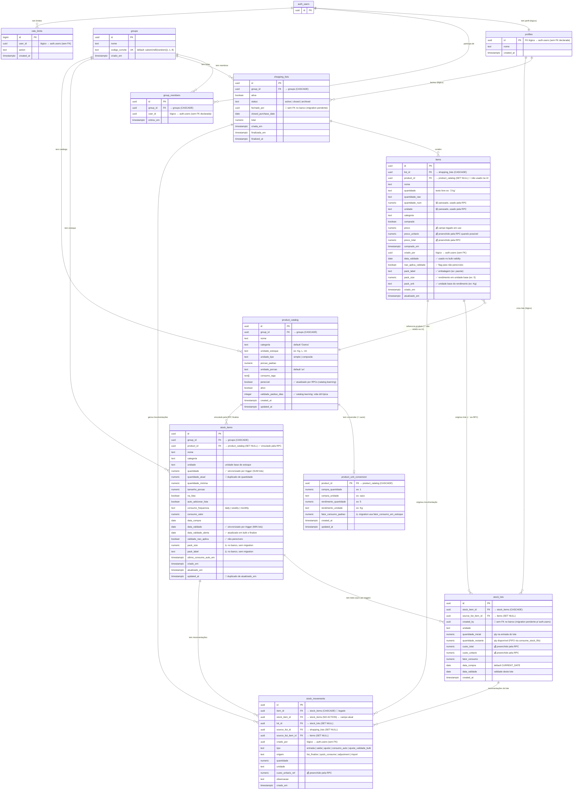

# Mapa do Banco de Dados — Meu Estoque

> [!NOTE]
> Mapa gerado em **02/05/2026** com base em inspeção direta do schema Supabase
> (ver `docs/supabase_inspection_results_20260502.md`).
> Este documento reflete o estado **real** do banco, não apenas as migrations versionadas.

> [!IMPORTANT]
> ⚠️ **Drift detectado entre migrations e banco real.** Algumas estruturas existem
> no banco mas não estão em `supabase/migrations/`, e algumas migrations versionadas
> não foram aplicadas. Detalhes na seção "Drift de Migrations" no final.

## Diagrama ER



---

## Legenda

| Ícone | Significado |
|---|---|
| ✅ | Existe e está sendo usado corretamente |
| 🟡 | Existe e é parcialmente usado |
| 🔴 | Existe mas **não implementado** na prática |
| 💰 | Campo de preço/custo |
| ⚠️ | Drift entre banco e migrations versionadas |

---

## Funções e RPCs

Funções presentes em `public` (verificado via `information_schema.routines`):

| Função | Tipo | Retorno | Propósito |
|---|---|---|---|
| `is_group_member(uuid)` | FUNCTION | boolean | Helper de RLS — verifica se `auth.uid()` pertence ao grupo |
| `create_group(...)` | FUNCTION | uuid | Cria grupo e adiciona o caller como membro |
| `join_group_by_code(...)` | FUNCTION | record | Entra em grupo por código de convite |
| `rpc_finalize_shopping_list(p_list_id, p_purchase_date)` | FUNCTION | record | Fecha lista, cria lots/movements, popula catálogo, faz catalog learning, abre próxima lista |
| `rpc_bulk_update_stock_validity(p_item_ids, p_data_validade, p_nao_aplica)` | FUNCTION | void | Atualiza validade em lote + registra `ajuste_validade_bulk` |
| `consume_stock_fifo(...)` | FUNCTION | numeric | Consome do lote mais antigo/próximo de vencer (⚠️ sem migration) |
| `set_updated_at()` | TRIGGER | trigger | Atualiza `updated_at = now()` |
| `set_updated_at_items()` | TRIGGER | trigger | Atualiza `atualizado_em = now()` em `items` |
| `set_atualizado_em_stock_items()` | TRIGGER | trigger | Atualiza `atualizado_em` em `stock_items` (⚠️ sem migration) |
| `sync_stock_item_quantity()` | TRIGGER | trigger | Mantém `stock_items.quantidade = SUM(lots.quantidade_restante)` (⚠️ sem migration) |
| `sync_stock_item_validade()` | TRIGGER | trigger | Mantém `stock_items.data_validade = MIN(lots.data_validade)` (⚠️ sem migration) |

---

## Triggers ativos

| Tabela | Trigger | Quando | Função |
|---|---|---|---|
| `items` | `trg_items_updated_at` | BEFORE UPDATE | `set_updated_at_items` |
| `product_catalog` | `trg_product_catalog_updated_at` | BEFORE UPDATE | `set_updated_at` |
| `product_unit_conversion` | `trg_product_unit_conversion_updated_at` | BEFORE UPDATE | `set_updated_at` |
| `stock_items` | `trg_stock_items_updated_at` | BEFORE UPDATE | `set_updated_at` |
| `stock_items` | `trg_set_atualizado_em_stock_items` | BEFORE UPDATE | `set_atualizado_em_stock_items` |
| `stock_lots` | `trg_sync_stock_item_quantity` | AFTER INSERT/UPDATE/DELETE | `sync_stock_item_quantity` |
| `stock_lots` | `trg_sync_stock_item_validade` | AFTER INSERT/UPDATE/DELETE | `sync_stock_item_validade` |

> 💡 **Implicação importante**: o design original previa `stock_items.quantidade` derivado
> de `SUM(lots.quantidade_restante)`. **Isso já está implementado via trigger**
> (`trg_sync_stock_item_quantity`). O mesmo vale para `data_validade` (sincronizada
> com o lote mais próximo de vencer via `trg_sync_stock_item_validade`).

---

## Políticas RLS (resumo)

Todas as tabelas de domínio são protegidas por `is_group_member(group_id)` ou
verificação transitiva via `EXISTS`. Resumo:

| Tabela | Política | Comando | Regra |
|---|---|---|---|
| `groups` | `groups_select_member` | SELECT | `is_group_member(id)` |
| `groups` | `groups_insert_authenticated` | INSERT | `true` (qualquer autenticado) |
| `group_members` | `gm_select_same_group` | SELECT | `is_group_member(group_id)` |
| `group_members` | `gm_insert_self` | INSERT | `auth.uid() = user_id` |
| `group_members` | `gm_delete_self` | DELETE | `auth.uid() = user_id` |
| `profiles` | `profiles_select_authenticated` | SELECT | `true` |
| `shopping_lists` | `shopping_lists_*_v2` | ALL | `is_group_member(group_id)` |
| `items` | `items_all_v2` | ALL | via `shopping_lists.group_id` |
| `product_catalog` | `product_catalog_*` | ALL | `is_group_member(group_id)` |
| `product_unit_conversion` | `product_unit_conversion_all` + `Acesso via produto` | ALL | via `product_catalog.group_id` (⚠️ **2 políticas duplicadas**) |
| `stock_items` | `stock_items_all_v2` | ALL | `is_group_member(group_id)` |
| `stock_lots` | `stock_lots_all` | ALL | via `stock_items.group_id` |
| `stock_movements` | `stock_movements_all_v2` | ALL | via `COALESCE(stock_item_id, item_id)` → `stock_items.group_id` |
| `rate_limits` | `rate_limits_insert_self` | INSERT | `auth.uid() = user_id` (⚠️ **sem SELECT/UPDATE/DELETE**) |

---

## Índices únicos relevantes

- `ux_shopping_lists_group_active` (= `idx_shopping_lists_active_group`): garante **apenas uma lista ativa por grupo** (`WHERE status = 'active'`). ⚠️ **Dois índices duplicados** com mesma definição.
- `ux_stock_items_group_product` (= `idx_stock_items_group_product`): unicidade de produto por grupo (`WHERE product_id IS NOT NULL`). ⚠️ Também duplicado.
- `ux_product_catalog_group_nome_unidade` (= `idx_product_catalog_unique`): unicidade case-insensitive de produto no catálogo. ⚠️ Duplicado.
- `groups.codigo_convite` único.
- `group_members (group_id, user_id)` único.

---

## O Que é Cada Tabela (Design Original)

### `stock_items` → O **produto** na despensa
Representa um tipo de produto que você mantém em casa (ex: Arroz, Leite, Carne moída).
Define a unidade base, mínimo, consumo automático etc.

### `stock_lots` → Os **lotes físicos** daquele produto
Cada compra de um produto cria um ou mais lotes, cada um com sua **data de validade**
e **custo**. Isso permite:
- Exibir "Leite: 2 lotes — vence 05/05 (1L) e 10/05 (2L)"
- Alertar sobre itens próximos de vencer
- Consumir pelo lote mais antigo primeiro (**FIFO** via `consume_stock_fifo`)
- Rastrear custo histórico por lote

```
stock_items: "Leite" (unidade: L, qty: 3 — sincronizado por trigger)
  └── stock_lots:
        ├── lote A: 1L, vence 05/05, comprado em 20/04, R$5.20/L
        └── lote B: 2L, vence 10/05, comprado em 20/04, R$5.20/L
```

### `stock_movements` → O **ledger** de entradas e saídas
Toda mudança de quantidade gera uma linha aqui. É o histórico auditável.

---

## Análise por Tabela

### `items` — Lista de compras
| Campo | Status | Observação |
|---|---|---|
| `quantidade` | ✅ | texto livre ("2 kg", "1 saco") |
| `quantidade_raw` | ✅ | cópia do texto original |
| `quantidade_num` | 🟡 | parseado, usado pela RPC |
| `unidade` | 🟡 | parseado, usado pela RPC |
| `preco` | ✅ | campo legado em uso |
| `preco_unitario` | 🟡 | preenchido pela RPC quando há `preco_total / quantidade_num` |
| `preco_total` | 🟡 | preenchido pela RPC |
| `product_id` | 🔴 | FK existe, nunca vinculada na UI |
| `data_validade` | ✅ | preenchido via UI antes da finalização |
| `nao_aplica_validade` | ✅ | flag de não-perecível |

### `product_unit_conversion` — Conversão de unidades
| Status | Observação |
|---|---|
| 🔴 | Tabela criada, **0 registros** — solução para arroz (1 saco = 5 Kg) |
| ⚠️ | Coluna `fator_consumo_padrao` no banco vs. `fator_consumo_em_estoque` na migration |

### `stock_items` — Produtos no estoque
| Campo | Status | Observação |
|---|---|---|
| `quantidade` | ✅ | **sincronizado por trigger** com `SUM(lots.quantidade_restante)` |
| `quantidade_atual` | 🔴 | duplicado de `quantidade` |
| `data_validade` | ✅ | **sincronizado por trigger** com `MIN(lots.data_validade)` |
| `data_validade_alerta` | ✅ | atualizado pela Bulk RPC e finalize |
| `validade_nao_aplica` | ✅ | controle de não-perecíveis |
| `pack_size` / `pack_label` | ⚠️ | existem no banco, **sem migration versionada** |
| `product_id` | ✅ | vinculado pela `rpc_finalize_shopping_list` |
| `updated_at` | 🔴 | duplicado de `atualizado_em` |

### `stock_lots` — Lotes por data de validade
| Status | Observação |
|---|---|
| ✅ | Criado pela `rpc_finalize_shopping_list` com custo e validade |
| ✅ | Triggers mantêm `stock_items.quantidade` e `data_validade` sincronizados |
| 🔴 | Fallback JS (fora da RPC) ainda não cria lotes — verificar `useInventoryFeatureWeb.ts` |
| 🔴 | UI não exibe nem gerencia lotes individualmente |

### `stock_movements` — Movimentações
| Campo | Status | Observação |
|---|---|---|
| `item_id` | 🔴 | campo legado (FK CASCADE), duplicado de `stock_item_id` |
| `stock_item_id` | ✅ | campo atual (FK NO ACTION) |
| `custo_unitario_ref` | ✅ | preenchido pela RPC finalize |
| `tipo` | ✅ | aceita `ajuste_validade_bulk` |

---

## Fluxos: Atual vs. Ideal

### Lista → Estoque (RPC `rpc_finalize_shopping_list`)

**Hoje (já implementado pela RPC):**
```
Para cada item comprado (i):
  1. Resolve product_catalog (cria se não existir)
  2. Resolve/cria stock_items
  3. Atualiza data_validade_alerta + catalog learning (validade_padrao_dias)
  4. INSERT stock_lots (com custo, validade)
     → trigger sync_stock_item_quantity recalcula stock_items.quantidade
     → trigger sync_stock_item_validade recalcula stock_items.data_validade
  5. INSERT stock_movements (tipo=entrada, origem=list_finalize, lot_id, custo_unitario_ref)
  6. Fecha lista, abre próxima, migra itens não comprados
```

✅ Cobertura: custo, lote, movimentação, sincronização — tudo coberto.

**Gaps remanescentes:**
- 🔴 `product_unit_conversion` ainda não é consultada (1 saco ≠ 5 Kg)
- 🔴 Fallback JS (quando a RPC falha) precisa replicar esse fluxo
- 🔴 UI não expõe lotes ao usuário

---

## ⚠️ Drift de Migrations

Estes itens **existem no banco real** mas **não têm migration versionada** em `supabase/migrations/`:

| Item | Onde foi observado |
|---|---|
| Tabelas base `groups`, `group_members`, `profiles`, `items` (criação) | Apenas `ALTER TABLE` nas migrations; criação inicial fora do repo |
| Tabela `rate_limits` | Existe, sem migration |
| `stock_items.pack_size`, `stock_items.pack_label` | Existem, sem migration |
| Função `consume_stock_fifo` | Existe, sem migration |
| Função `sync_stock_item_quantity` + trigger | Existe, sem migration |
| Função `sync_stock_item_validade` + trigger | Existe, sem migration |
| Função `set_atualizado_em_stock_items` + trigger | Existe, sem migration |
| Função `create_group` | Existe, sem migration |
| Função `join_group_by_code` | Existe, sem migration |
| Coluna `product_unit_conversion.fator_consumo_padrao` | Migration usa `fator_consumo_em_estoque`, banco tem `fator_consumo_padrao` |
| Índices duplicados (`idx_*` vs `ux_*`) em 3 tabelas | Criados manualmente além das migrations |
| Política RLS duplicada `Acesso via produto` em `product_unit_conversion` | Resíduo manual |

Estes itens estão na migration **versionada mas NÃO aplicada** ao banco real:

| Migration | O quê | Evidência |
|---|---|---|
| `20260501100000_fix_fkey_auth_users.sql` | FKs `stock_lots.created_by` e `shopping_lists.fechado_por` → `auth.users` | Banco não tem essas FKs declaradas (verificado em `information_schema`) |

---

## Plano de Implementação

### 🗄️ Banco (Supabase) — Reconciliação de drift
- [ ] Criar migration retroativa para `groups`, `group_members`, `profiles`, `items` (base)
- [ ] Criar migration para `rate_limits`
- [ ] Criar migration para `stock_items.pack_size` e `pack_label`
- [ ] Criar migrations para `consume_stock_fifo`, `sync_stock_item_quantity`, `sync_stock_item_validade`, `set_atualizado_em_stock_items`, `create_group`, `join_group_by_code`
- [ ] Renomear `fator_consumo_em_estoque` → `fator_consumo_padrao` na migration original (ou criar correção)
- [ ] Aplicar `20260501100000_fix_fkey_auth_users.sql` no banco real
- [ ] Remover índices duplicados (`idx_shopping_lists_active_group`, `idx_stock_items_group_product`, `idx_product_catalog_unique`)
- [ ] Remover política RLS duplicada `Acesso via produto` em `product_unit_conversion`

### 🗄️ Banco — Limpeza de campos legados
- [ ] Drop `stock_items.quantidade_atual` (duplicado de `quantidade`)
- [ ] Drop `stock_items.updated_at` (duplicado de `atualizado_em`)
- [ ] Drop `stock_movements.item_id` (legado, usar só `stock_item_id`)

### 🖥️ App — Preço
- [ ] UI: campo `preco_unitario` (R$/Kg ou R$/embalagem) na lista
- [ ] UI: `preco_total = quantidade_num × preco_unitario` calculado automaticamente

### 🖥️ App — Lotes
- [ ] Fallback JS (fora da RPC): criar `stock_lots` com custo e validade
- [ ] Finalização: consultar `product_unit_conversion` quando houver
- [ ] UI estoque: exibir lotes ativos (validade + quantidade restante)
- [ ] UI estoque: alertas de lotes próximos de vencer
- [ ] Consumo: usar `consume_stock_fifo` no fluxo manual

### 🖥️ App — Cadastro de produto
- [ ] Campo `pack_size` + `pack_label` na UI → alimenta conversão
- [ ] Sugerir `data_validade` automaticamente usando `product_catalog.validade_padrao_dias`
